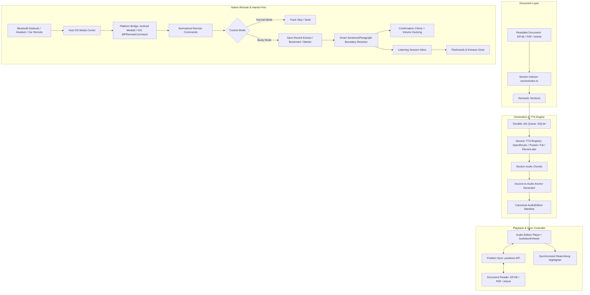

# Technical Design: Audio Editions & Hands-Free Study Mode

## Context

Plethora (Incrementum) is a multi-platform spaced repetition and incremental reading system built with React 19, TypeScript, TailwindCSS, and a Rust backend powered by Tauri 2.0. The application currently features:
1. **TTS Registry (`src/api/tts/`)**: 8+ provider adapters (`openrouter`, `pocket`, `fal`, `android`, `elevenlabs`, `openai`, `openai-compatible`, `system`) with live catalog discovery, snapshot caching, and credential borrowing from LLM provider settings.
2. **Audiobook Player & Shelf (`src/components/viewer/AudiobookViewer.tsx`, `AudiobooksTab.tsx`)**: Standalone audiobook playback, Whisper/Groq transcription, and local media HTTP server streaming.
3. **EPUB/Audiobook Synchronization (`AudiobookEpubSyncView.tsx`, `epubSync.ts`)**: Experimental DOM-based transcript matching between standalone audiobooks and EPUBs.
4. **Document Hierarchy Engine (`src/utils/sectionIndex.ts`)**: Robust tree-building and heading extraction from EPUB TOC, PDF outlines/reflow, and Markdown/HTML structures.
5. **Native Mobile Plugins (`plethora-android-tts`)**: On-device sherpa-onnx and foreground service for basic text-to-speech.

### Problem & Opportunity
Despite these pieces, Plethora's audio experience is disjointed. Audiobooks are treated as external, monolithic files rather than native representations of reading material. Generating audio from text blocks the user until long files render, reading and listening progress are tracked in separate silos, and mobile listeners cannot capture notes or extracts hands-free while walking, exercising, or commuting.

This design unifies all reading documents into a first-class **Audio Edition** architecture paired with an operating-system-level **Hands-Free Study Mode**.

---

## Goals / Non-Goals

### Goals
- **Universal Audio Editions**: Enable one-click creation of synchronized Audio Editions for EPUBs, PDFs, reflowed PDFs, and web articles.
- **Semantic Chapterization**: Derive playback chapters from actual document structure (TOC, outlines, headings) rather than arbitrary character splits.
- **Progressive Generation**: Allow users to start listening to Chapter 1 immediately while subsequent chapters continue generating in the background.
- **Generic Provider Dispatch with OpenRouter Reuse**: Route synthesis through the existing TTS registry with simple Quality presets (Fast / Natural / Best), in-situ voice preview from document text, and transparent cost/duration guardrails.
- **Unified Reading & Listening Position**: Maintain bidirectional sync between visual reading position and audio playback timestamp.
- **Hands-Free Study Mode**: Intercept standard OS-level headphone/media remote commands (AirPods, Galaxy Buds, Pixel Buds, Sony/Bose, wired headsets, car Bluetooth) while the phone is locked in a pocket to capture source-linked text extracts and semantic markers.
- **Smart Extract Expansion**: Expand hands-free extract captures to clean sentence and paragraph boundaries using stored source/audio anchor intervals.
- **Listening Session Inbox**: Provide a lightweight deferred review inbox ("Remember now, organize later") for triaging captured extracts, notes, and flashcards.
- **Listen Later Queue**: Support an auto-advancing audio queue for web articles and document chapters.

### Non-Goals
- Building a second independent TTS engine or bypassing the existing provider registry.
- Generating monolithic 500MB MP3 files for entire books.
- Hardcoding vendor-specific headphone SDKs (e.g. proprietary Apple AirPods or Sony SDKs) instead of relying on standard OS media commands.
- Recording device microphone or environmental audio to capture extracts.
- Blocking full-book playback when a single section fails generation.
- Requiring the phone screen to stay awake for media controls.

---

## Architecture & System Flow



---

## Decisions

### 1. Canonical Audio Edition Data Model
- **Decision**: Represent each Audio Edition as a structured SQLite entity (`audio_editions`) with child tables (`audio_edition_sections`, `audio_edition_anchors`) rather than a single audio file or loose JSON in `localStorage`.
- **Rationale**:
  - Enables independent section generation, caching, retries, and deletions.
  - Allows precise indexing for fast playback seek to source anchor lookups.
  - Survives app restarts and mobile process termination.
- **Alternatives Considered**:
  - *Single concatenated audio file*: Impractical for progressive playback and makes per-chapter retries impossible.
  - *Loose JSON files in app directory*: Lacks transactional integrity, making crash recovery fragile.

#### Database Schema
```sql
CREATE TABLE IF NOT EXISTS audio_editions (
    id TEXT PRIMARY KEY,
    source_document_id TEXT NOT NULL REFERENCES documents(id) ON DELETE CASCADE,
    source_revision_hash TEXT NOT NULL,
    provider TEXT NOT NULL,
    model TEXT NOT NULL,
    voice TEXT NOT NULL,
    quality_preset TEXT,
    generation_settings TEXT, -- JSON blob (speed, response_format, instructions)
    total_duration_sec REAL DEFAULT 0.0,
    status TEXT NOT NULL CHECK(status IN ('draft', 'generating', 'ready', 'failed', 'stale')),
    created_at INTEGER NOT NULL,
    updated_at INTEGER NOT NULL
);

CREATE TABLE IF NOT EXISTS audio_edition_sections (
    id TEXT PRIMARY KEY,
    edition_id TEXT NOT NULL REFERENCES audio_editions(id) ON DELETE CASCADE,
    section_index INTEGER NOT NULL,
    title TEXT NOT NULL,
    source_section_id TEXT,
    source_start_anchor TEXT, -- CFI or character offset or word ID
    source_end_anchor TEXT,
    character_count INTEGER NOT NULL,
    audio_file_path TEXT,
    audio_mime_type TEXT DEFAULT 'audio/mp3',
    duration_sec REAL DEFAULT 0.0,
    generation_status TEXT NOT NULL CHECK(generation_status IN ('queued', 'generating', 'ready', 'failed', 'stale')),
    failure_reason TEXT,
    retry_count INTEGER DEFAULT 0,
    cache_key TEXT NOT NULL,
    created_at INTEGER NOT NULL,
    updated_at INTEGER NOT NULL
);

CREATE TABLE IF NOT EXISTS audio_edition_anchors (
    id TEXT PRIMARY KEY,
    section_id TEXT NOT NULL REFERENCES audio_edition_sections(id) ON DELETE CASCADE,
    audio_start_sec REAL NOT NULL,
    audio_end_sec REAL NOT NULL,
    source_start_anchor TEXT NOT NULL,
    source_end_anchor TEXT NOT NULL,
    text_content TEXT NOT NULL
);

CREATE INDEX IF NOT EXISTS idx_audio_editions_doc ON audio_editions(source_document_id);
CREATE INDEX IF NOT EXISTS idx_audio_edition_sections_edition ON audio_edition_sections(edition_id, section_index);
CREATE INDEX IF NOT EXISTS idx_audio_edition_anchors_section ON audio_edition_anchors(section_id, audio_start_sec);
```

---

### 2. Semantic Chapterization Strategy
- **Decision**: Feed documents through `src/utils/sectionIndex.ts` to extract semantic chapters:
  - **EPUB**: Read TOC and spine items via `convertEpubTocToSectionNodes`.
  - **PDF**: Read embedded outline via `convertPdfOutlineToSectionNodes`, falling back to reflow headings.
  - **Articles/HTML**: Read `<h1>`, `<h2>`, `<h3>` tags and major structural elements.
  - **Unstructured Fallback**: Heuristic paragraph grouping (Introduction, Key Points, Conclusion) via `buildHeuristicParagraphSections`.
- **Rationale**: Real books have natural reading pauses at chapters. Fixed-length slicing (e.g. every 2000 words) cuts sentences midway and prevents meaningful chapter navigation.

---

### 3. Progressive Generation & Error Isolation
- **Decision**: The generation worker executes sequentially or with bounded concurrency (e.g., 2 workers) per section. As soon as Section 1 finishes, `AudioEdition.status` transitions to `generating` and Section 1 becomes playable (`generation_status: 'ready'`). If Section 3 fails, it transitions to `failed`, Section 4 proceeds, and completed sections remain fully playable.
- **Rationale**: Eliminates the "wait 20 minutes before listening to a book" friction. Minimizes API waste upon failure.

---

### 4. Generic TTS Dispatch, Quality Presets & Guardrails
- **Decision**: Integrate with the existing `TTSProviderAdapter` registry in `src/api/tts/registry.ts`.
  - Provide a default simple selector:
    - **Fast**: Pocket TTS (local on-device) or Kokoro (OpenRouter / Android).
    - **Natural**: Deepgram Aura-2 / MiniMax / OpenAI `tts-1`.
    - **Best**: ElevenLabs Multilingual v2 / OpenAI `tts-1-hd`.
  - Provide an **Advanced** expandable toggle exposing provider, model ID, voice browser, speed, and format.
  - Provide **Voice Audition Preview**: Synthesize a 5-second snippet of the current document's first paragraph.
  - Provide **Pre-Flight Estimation**: Calculate total characters, estimated duration ($\approx 150 \text{ words/min}$ or $900 \text{ chars/min}$), and cost based on `model.costPerMillionTokens` or `model.pricing`.

---

### 5. Source-to-Audio Anchoring & Bidirectional Synchronization
- **Decision**: During section synthesis, chunk text into paragraphs/sentences. Record the calculated start and end times for each chunk. Store these as `audio_edition_anchors`.
- **Bidirectional Mapping**:
  - **Reading $\to$ Listening**: When clicking "Listen from here" at source anchor $A$, find the anchor record containing $A$ and seek audio player to `audio_start_sec`.
  - **Listening $\to$ Reading**: When closing the audio player or tapping "Open in book" at playback time $T$, query `audio_edition_anchors` WHERE `audio_start_sec <= T <= audio_end_sec`, retrieve `source_start_anchor`, and navigate the document viewer.
  - **Read-Along**: While playing, track active anchor and emit highlighting updates to `DocumentViewer`.

---

### 6. Native Media Session & Headphone Remote Normalization
- **Decision**: Implement native media bridges:
  - **Android**: Android Media3 `MediaSession` connected to `MediaSessionService` foreground service in `plethora-android-tts`.
  - **iOS**: `MPRemoteCommandCenter` and `AVAudioSessionCategoryPlayback`.
  - **Desktop**: Native media keys and Web `navigator.mediaSession`.
- **Normalized Command Stream**:
  All hardware inputs map to a single internal enum:
  ```typescript
  export type RemoteMediaCommand =
    | "play"
    | "pause"
    | "togglePlayPause"
    | "next"
    | "previous"
    | "seekForward"
    | "seekBackward";
  ```

---

### 7. Hands-Free Study Mode & Smart Recent Extract Boundary Expansion
- **Decision**:
  - Provide a mode toggle: **Normal** vs. **Study**.
  - In **Study Mode**, `next` maps to `saveRecentExtract` and `previous` maps to `replayRecentPassage`.
  - **Smart Boundary Calculation**:
    When `saveRecentExtract` fires at timestamp $T$:
    1. Define window $[T - W, T]$ where $W$ is the configured lookback duration (default 30 seconds).
    2. Query all anchors overlapping this window.
    3. Expand start to the beginning of the earliest sentence/paragraph in the window.
    4. Expand end to the conclusion of the currently playing sentence.
    5. Save a permanent source-linked extract record in `extracts` table and register an item in the active `ListeningSession`.
  - **Confirmation Feedback**: Play a subtle audio chime (50ms sine sweep or short marimba ping) and duck playback volume to 40% for 300ms without pausing.
  - **Multi-Press Extension**: If `saveRecentExtract` is triggered again within 2.5 seconds, extend the start boundary backward to the preceding paragraph and play an extended chime.

---

### 8. Listening Session Inbox Architecture
- **Decision**: Hands-free items are tagged with a `sessionId` and collected in `listening_sessions` table.
- **Triage UX**:
  When the user returns to the app, a "Review Listening Session" bar appears on the Home/Audiobooks tab. The inbox displays each item with:
  - Source book title and chapter
  - Timestamp and clean text snippet
  - Quick action buttons: **Keep Extract**, **Add Note**, **Make Flashcard**, **Ask Plethora**, **Discard**.

```sql
CREATE TABLE IF NOT EXISTS listening_sessions (
    id TEXT PRIMARY KEY,
    edition_id TEXT NOT NULL REFERENCES audio_editions(id) ON DELETE CASCADE,
    started_at INTEGER NOT NULL,
    ended_at INTEGER,
    duration_seconds INTEGER DEFAULT 0,
    extract_count INTEGER DEFAULT 0,
    is_reviewed INTEGER DEFAULT 0
);

CREATE TABLE IF NOT EXISTS listening_session_items (
    id TEXT PRIMARY KEY,
    session_id TEXT NOT NULL REFERENCES listening_sessions(id) ON DELETE CASCADE,
    extract_id TEXT REFERENCES extracts(id) ON DELETE SET NULL,
    marker_type TEXT NOT NULL CHECK(marker_type IN ('extract', 'bookmark', 'interesting', 'confusing')),
    audio_timestamp REAL NOT NULL,
    source_anchor TEXT NOT NULL,
    snippet_text TEXT NOT NULL,
    note TEXT,
    created_at INTEGER NOT NULL
);
```

---

## Risks / Trade-offs & Mitigations

| Risk / Trade-off | Mitigation |
| :--- | :--- |
| **Paid API Rate Limits & Timeouts** | Section-level generation isolates failures. Retrying a failed chapter does not regenerate completed chapters. |
| **Android Background Process Killing** | Use Android Media3 `MediaSessionService` with a high-priority foreground notification to keep the process alive while screen is locked. |
| **Proprietary Vendor Headphone Gestures** | Plethora documents clearly that only standard OS media commands are captured. Hardware-reserved actions (ANC mode switches, proprietary Siri/Assistant triggers) cannot and should not be intercepted. |
| **Fuzzy Alignment in Paired External Audiobooks** | 3-tier confidence scoring (`high`, `medium`, `low`). Medium and low confidence captures save audio timestamps and candidate text ranges, prompting the user for quick confirmation in the Session Inbox rather than corrupting the text library. |
| **High Memory Usage on Long Audiobooks** | Chunks are loaded as streaming HTTP audio from the local media server or native player rather than retaining all decoded ArrayBuffers in React memory. |

---

## Migration & Rollout Plan

1. **Database Migrations**: Run additive SQLite migrations creating `audio_editions`, `audio_edition_sections`, `audio_edition_anchors`, `listening_sessions`, and `listening_session_items`.
2. **Legacy Data Migration**:
   - On first startup with the new version, scan existing audio documents and `audiobook-*` `localStorage` entries.
   - For each legacy audiobook, create an `AudioEdition` record referencing the existing audio file path as Section 1.
   - Convert legacy transcript segments into `audio_edition_anchors`.
3. **Rollout Phases**:
   - **Phase 1 (Foundation)**: Canonical Audio Edition model, semantic chapterization, progressive generation, OpenRouter/generic TTS dispatch, cost estimate, and voice preview.
   - **Phase 2 (Synchronization & Reading)**: Bidirectional read/listen sync, source anchors, read-along highlighting, "Listen from here", and learning actions.
   - **Phase 3 (Hands-Free Study Mode)**: Native Android/iOS media session integration, remote command mapping, Smart Recent Extract, confirmation feedback, and Listening Session Inbox.
   - **Phase 4 (Extended Experience)**: Listen Later queue, continuous auto-advancing playlist, and pronunciation dictionary.
