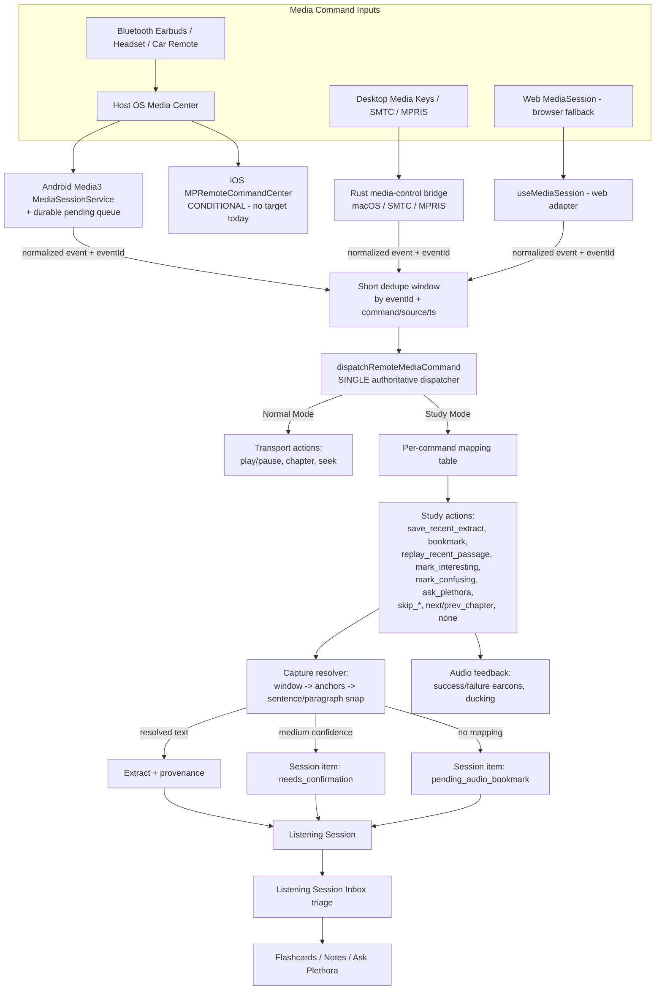

# Technical Design: Audio Editions & Hands-Free Study Mode

## Context

Plethora (Incrementum) is a multi-platform spaced repetition and incremental reading system built with React 19, TypeScript, TailwindCSS, and a Rust backend powered by Tauri 2.0. Relevant existing subsystems:

1. **TTS Registry (`src/api/tts/`)**: 8+ provider adapters (`openrouter`, `pocket`, `fal`, `android`, `elevenlabs`, `openai`, `openai-compatible`, `system`) with live catalog discovery, snapshot caching, and credential borrowing from LLM provider settings.
2. **Audiobook Player & Shelf (`src/components/viewer/AudiobookViewer.tsx`, `AudiobooksTab.tsx`)**: Standalone audiobook playback, Whisper/Groq transcription, and local media HTTP server streaming.
3. **EPUB/Audiobook Synchronization (`AudiobookEpubSyncView.tsx`, `epubSync.ts`)**: Experimental DOM-based transcript matching between standalone audiobooks and EPUBs.
4. **Document Hierarchy Engine (`src/utils/sectionIndex.ts`)**: Tree-building and heading extraction from EPUB TOC, PDF outlines/reflow, and Markdown/HTML structures.
5. **Native Mobile Plugins (`plethora-android-tts`)**: On-device sherpa-onnx, a plain foreground `TtsPlaybackService` (notification-only, **no Media3/media-button support**), and a `webView.evaluateJavascript` CustomEvent channel (`tts://…`) that already reaches the frontend.
6. **Audio Edition backend (`src-tauri/src/commands/audio_editions.rs`)**: 23 Tauri commands over SQLite tables `audio_editions`, `audio_edition_sections`, `audio_edition_anchors`, `listening_sessions`, `listening_session_items` (migration `089`).

### Audit Findings Driving This Design (2026-08-19)

The first implementation pass built real foundation (schema, chapterization, generation queue, sync hook, dispatcher skeleton, feedback utilities, inbox component) but left the feature unreachable:

- The dispatcher (`remoteMediaDispatcher.ts`) and hook (`useMediaSession.ts`) have **zero production callers**; `AudiobookViewer.tsx:1836-1883` still registers legacy direct `navigator.mediaSession` handlers that bypass them (two competing command paths).
- `handsFreeStudy` settings have **no UI**; `createListeningSession` is **never called**; `ListeningSessionInbox.tsx` is **never mounted**; `useAudioEditionSync` is **imported by no viewer**; `runLegacyAudiobookMigration` is **never invoked**.
- Two contradictory `StudyActionType` unions and two incompatible settings shapes exist; the dispatcher implements 4 actions, hard-codes `Previous`/`SeekBackward` to `bookmark`, and its multi-press model (single/double/triple → different actions) contradicts the original repeat-extension design.
- Smart extract falls back to placeholder text (`Audio extract at 123s`) on anchor miss.
- `audioFeedback.ts` ignores `chimeVolume`, has no failure earcon, never plays `mode_study`/`mode_normal`, and can permanently strand ducked volume.
- **No native media sessions exist**: Android plugin has no Media3/media-button code; the repository has **no iOS target at all** (no `gen/apple`, no Swift for this feature); desktop has no native media-key bridge (macOS WKWebView does not deliver system media keys to `navigator.mediaSession`).
- `updateListeningSessionItem` is a silent no-op under Tauri (no Rust command), breaking Inbox triage persistence; `add_listening_session_item` bumps `extract_count` for every marker type and `delete` never decrements.

This design finishes and hardens the feature without discarding working infrastructure (see *Preserved Infrastructure*).

---

## Goals / Non-Goals

### Goals
- **Universal Audio Editions**: One-click creation of synchronized Audio Editions for EPUBs, PDFs, reflowed PDFs, and web articles.
- **Semantic Chapterization**: Playback chapters from actual document structure.
- **Progressive Generation**: Listen to Chapter 1 immediately while later chapters generate.
- **Generic Provider Dispatch with Quality Presets**: Fast / Natural / Best, in-situ voice preview, transparent cost/duration guardrails.
- **Unified Reading & Listening Position**: Bidirectional sync between visual reading position and audio playback timestamp, actually integrated into viewers.
- **Hands-Free Study Mode**: Standard OS-level headphone/media remote commands (any brand) while the phone is locked in a pocket capture source-linked text extracts and semantic markers.
- **Single Authoritative Command Path**: One normalized dispatcher; no competing handlers.
- **Locked-Screen Reliability**: No silently lost button presses when the WebView is backgrounded or suspended.
- **Smart Extract Expansion**: Captures expand to clean sentence/paragraph boundaries from stored anchors (or timed transcripts), with typed fallbacks instead of fake text.
- **Listening Session Inbox**: Deferred review ("Remember now, organize later") with complete triage.
- **Listen Later Queue**: Auto-advancing audio queue for articles and document chapters.

### Non-Goals
- Building a second TTS engine or bypassing the existing provider registry.
- Generating monolithic 500MB MP3 files for entire books.
- Hardcoding vendor-specific headphone SDKs (AirPods/Sony/Galaxy proprietary gestures) — Plethora reacts only to standard OS media commands.
- Recording device microphone or environmental audio.
- Blocking full-book playback when a single section fails generation.
- Requiring the phone screen to stay awake for media controls.
- **iOS support in this change**: the repository has no iOS build target; iOS requirements in the specs are conditional and explicitly deferred (no `MPRemoteCommandCenter`/`AVAudioSession` code will be written speculatively).
- Background AI answer generation for "Ask Plethora" (v1 defers the question; see Decision 9).

---

## Architecture & System Flow



---

## Decisions

### 1. Canonical Audio Edition Data Model *(unchanged — implemented)*
Audio Editions persist as SQLite entities (`audio_editions`) with child tables (`audio_edition_sections`, `audio_edition_anchors`); verified consistent across migration, repository, and TS types. Additional hardening decisions:

- Add a `UNIQUE` constraint path for "one active edition per document" via `get_audio_edition_by_document` ordering (already `ORDER BY created_at DESC LIMIT 1`); multiple editions per document remain allowed, the API returns the newest.
- `find_anchor_by_source` currently compares anchors as **strings** (`BETWEEN` on TEXT). Since TS anchors are numeric character offsets, Rust must compare numerically (`CAST(source_start_anchor AS REAL)` or zero-padded storage) — fixed in this change.
- `marker_type` gets application-level validation in Rust (reject early with a typed error instead of relying on the SQLite CHECK surfacing as a generic `sqlx::Internal` error).

#### Database Schema (existing, retained)
```sql
CREATE TABLE IF NOT EXISTS audio_editions (
    id TEXT PRIMARY KEY,
    source_document_id TEXT NOT NULL REFERENCES documents(id) ON DELETE CASCADE,
    source_revision_hash TEXT NOT NULL,
    provider TEXT NOT NULL,
    model TEXT NOT NULL,
    voice TEXT NOT NULL,
    quality_preset TEXT,
    generation_settings TEXT, -- JSON blob (speed, response_format, instructions)
    total_duration_sec REAL DEFAULT 0.0,
    status TEXT NOT NULL CHECK(status IN ('draft', 'generating', 'ready', 'failed', 'stale')),
    created_at INTEGER NOT NULL,
    updated_at INTEGER NOT NULL
);

CREATE TABLE IF NOT EXISTS audio_edition_sections (
    id TEXT PRIMARY KEY,
    edition_id TEXT NOT NULL REFERENCES audio_editions(id) ON DELETE CASCADE,
    section_index INTEGER NOT NULL,
    title TEXT NOT NULL,
    source_section_id TEXT,
    source_start_anchor TEXT, -- CFI or character offset or word ID
    source_end_anchor TEXT,
    character_count INTEGER NOT NULL,
    audio_file_path TEXT,
    audio_mime_type TEXT DEFAULT 'audio/mp3',
    duration_sec REAL DEFAULT 0.0,
    generation_status TEXT NOT NULL CHECK(generation_status IN ('queued', 'generating', 'ready', 'failed', 'stale')),
    failure_reason TEXT,
    retry_count INTEGER DEFAULT 0,
    cache_key TEXT NOT NULL,
    created_at INTEGER NOT NULL,
    updated_at INTEGER NOT NULL
);

CREATE TABLE IF NOT EXISTS audio_edition_anchors (
    id TEXT PRIMARY KEY,
    section_id TEXT NOT NULL REFERENCES audio_edition_sections(id) ON DELETE CASCADE,
    audio_start_sec REAL NOT NULL,
    audio_end_sec REAL NOT NULL,
    source_start_anchor TEXT NOT NULL,
    source_end_anchor TEXT NOT NULL,
    text_content TEXT NOT NULL
);

CREATE INDEX IF NOT EXISTS idx_audio_editions_doc ON audio_editions(source_document_id);
CREATE INDEX IF NOT EXISTS idx_audio_edition_sections_edition ON audio_edition_sections(edition_id, section_index);
CREATE INDEX IF NOT EXISTS idx_audio_edition_anchors_section ON audio_edition_anchors(section_id, audio_start_sec);
```

New additive migration (Decision 8) adds `pending_media_commands`; see that section.

### 2. Semantic Chapterization *(unchanged — implemented)*
Documents flow through `src/utils/sectionIndex.ts`: EPUB TOC/spine (`convertEpubTocToSectionNodes`), PDF outlines (`convertPdfOutlineToSectionNodes`) with reflow-heading fallback, HTML `<h1>`-`<h3>` segmentation, heuristic paragraph fallback. Tested in `sectionIndex.audioEdition.test.ts`.

### 3. Progressive Generation & Error Isolation *(unchanged — implemented)*
Sequential per-section worker (`audioEditionGenerationStore.ts`) with per-section retry/pause/resume/cancel, anchor persistence after each section, and durable Zustand-persisted job state. Consumers: `CreateAudioEditionDialog`.

### 4. Generic TTS Dispatch, Quality Presets & Guardrails *(unchanged — implemented)*
Existing `TTSProviderAdapter` registry with Fast/Natural/Best presets, Advanced selector, document-text audition preview, and pre-flight character/duration/cost estimation (`audioEditionEstimation.ts`). One addition: the global pronunciation dictionary from TTSSettings is applied as the base layer with per-edition overrides merged on top (today only the per-edition dictionary is consulted and no UI populates it).

### 5. Source-to-Audio Anchoring & Bidirectional Synchronization *(implemented as a hook; integration added by this change)*
`useAudioEditionSync.ts` already resolves listen→read (anchor at timestamp, high/medium/low confidence) and read→listen (source anchor → audio seconds). This change actually integrates it:
- `AudiobookViewer` uses it when playing an Audio Edition.
- Document viewers (`EPUBViewer`, `PDFViewer`, article viewer) expose "Listen from here" and read-along highlighting through it.
- For **file-based audiobooks with timed transcripts** (Whisper/Groq segments or imported SRT/transcript data), transcript segments are converted into the same `AudioEditionAnchor` shape at load time (in-memory or persisted via a generated edition) so hands-free capture works identically. High-quality existing transcripts must not require Audio Edition generation.

### 6. Platform Media Sessions — Explicit Per-Platform Strategy (replaces the original single "native bridges" decision)

**Core rule: browser `navigator.mediaSession` is NOT evidence of native lock-screen support.** The design distinguishes four adapters, all feeding the same dispatcher, with **exactly one active adapter per platform** (no dual registration):

| Platform | Active adapter | Rationale |
| --- | --- | --- |
| Android (Tauri app) | **Native Media3 bridge** (plugin) | WebView JS cannot be assumed alive when locked; Media3 `MediaSessionService` + foreground service is the only reliable path for lock-screen controls, Bluetooth media buttons, and headset/car remotes. Web MediaSession handlers are NOT registered on Android. |
| iOS | **Deferred — no build target** | The repository has no iOS target (`src-tauri/gen/apple` absent, no Swift sources for this feature). No speculative `MPRemoteCommandCenter`/`AVAudioSession` code is written. When an iOS target lands, implement `AVAudioSession` (playback category) + `MPRemoteCommandCenter` emitting the same normalized events; spec requirements are written conditionally. |
| Desktop (macOS/Windows/Linux) | **Rust media-control bridge** (macOS media keys, Windows SMTC, Linux MPRIS — e.g. the `souvlaki` crate) | Tauri macOS uses WKWebView, which does not deliver system media keys to `navigator.mediaSession`; a native Rust bridge emitting Tauri events is required. The bridge also publishes metadata/playback-state so OS media UIs stay accurate. |
| Pure browser/dev mode | **Web MediaSession adapter** (`useMediaSession.ts`) | Kept as the only adapter when not running inside Tauri (e.g. web dev build). |

**Normalized command stream** (canonical casing; the duplicated lowercase variants in `types/audioEdition.ts` are removed):
```typescript
export type RemoteMediaCommand =
  | "Play" | "Pause" | "TogglePlayPause"
  | "Next" | "Previous"
  | "SeekForward" | "SeekBackward";
```
Every adapter emits `RemoteMediaCommandEnvelope { command, eventId (UUID), source: "android" | "desktop" | "web", occurredAt (epoch ms) }`.

**Android native bridge** (upgrade inside `plethora-android-tts`, which already owns the `mediaPlayback` foreground-service type and the `webView.evaluateJavascript` event channel):
- Add `androidx.media3:media3-session` (+ `media3-common`) and replace/augment `TtsPlaybackService` with a Media3 `MediaSessionService` hosting a `MediaSession` bound to a forwarding/no-op `Player` (audio itself keeps rendering in the WebView — no native ExoPlayer migration in this change).
- Media buttons / lock-screen / Bluetooth / car remotes arrive via the session; `onMediaButtonEvent` and session callbacks normalize KEYCODE_MEDIA_* into the command enum.
- Each command is (a) emitted to the WebView as a `media://remote-command` CustomEvent with the envelope (reusing the proven `tts://` channel pattern) and (b) **durably appended** to a native pending-command store (plugin-owned JSON file; see Decision 8).
- Actionable media notification (play/pause + next/previous), audio-focus handling (pause/duck on loss, resume on gain per Android conventions), correct session lifecycle cleanup on pause/stop/destroy.
- Frontend acks commands via a plugin command (`ack_media_commands(eventIds)`); on WebView resume the frontend drains unacked commands (`drain_pending_media_commands`) and reconciles.

**Desktop bridge** (new Rust module in `src-tauri`): a media-control handle (macOS now-playing/SCNS, Windows SMTC, Linux MPRIS) that
- emits `remote-media-command` Tauri events with the same envelope,
- accepts metadata/playback-state updates from the frontend (title, artist, duration, position, play/pause),
- is created when audio playback starts and destroyed when the player unmounts (clean OS integration teardown).

### 7. Study Mode Interaction Model v2 — OS Command Is Authoritative (resolves the gesture-model contradiction)

**Decision**: Plethora never detects vendor gestures. It reacts to the **normalized OS command** the headset emits. The previous single/double/triple-press model (press count → *different* actions) is **removed**; the original repeat-*extension* semantics are **kept and actually implemented**:

- **Per-command mappings** (Settings v2): each of `Next`, `Previous`, `SeekForward`, `SeekBackward` independently maps to one action. `Play`/`Pause`/`TogglePlayPause` are never remappable (always transport).
- **Repeat-extension**: if `save_recent_extract` fires again within `extensionWindowMs` (default 2500 ms) of the previous *successful* save for the same session, the same capture is **extended backward by one semantic unit** (paragraph, else sentence group) — the existing extract and session item are **updated in place** (no duplicate record, capped at 3 extensions) — and an "extended" confirmation earcon plays. A repeat of a *different* action simply performs that action.
- The 450 ms multi-press debounce in the current dispatcher is deleted along with its module-global press counters (state becomes dispatcher-instance-scoped, keyed by session).

**Canonical action enum** — one union shared by settings schema, settings UI, dispatcher, tests, and persisted state (the two divergent `StudyActionType` unions and `StudyModeConfig` are deleted):
```typescript
export type StudyAction =
  | "save_recent_extract" | "bookmark" | "replay_recent_passage"
  | "mark_interesting" | "mark_confusing" | "ask_plethora"
  | "skip_forward" | "skip_backward" | "next_chapter" | "previous_chapter"
  | "none";
```
Every value has an implementation, a user-facing label, tests, and a legacy-value fallback. Defaults: `Next → save_recent_extract`, `Previous → replay_recent_passage`, `SeekForward → skip_forward (+30s)`, `SeekBackward → skip_backward (−15s)`.

**Settings v2 shape** (replaces the v1 `singlePressAction`/`doublePressAction`/`triplePressAction` model; `captureLookbackSec` becomes the explicit `captureWindow`):
```typescript
interface HandsFreeStudySettings {
  enabled: boolean;                       // default false
  captureWindow: 15 | 30 | 60 | "smart";  // default 30; "smart" snaps to semantic units
  extensionWindowMs: number;              // default 2500
  mappings: {
    next: StudyAction;       // default save_recent_extract
    previous: StudyAction;   // default replay_recent_passage
    seekForward: StudyAction;   // default skip_forward
    seekBackward: StudyAction;  // default skip_backward
  };
  chimeEnabled: boolean;                  // default true
  chimeVolume: number;                    // 0..1, default 0.8 — actually consumed
  duckingRatio: number;                   // 0..1 = volume floor during duck, default 0.25
}
```
**Migration** (defensive, in settings rehydration): map v1 `singlePressAction` → `mappings.next`; drop double/triple actions; `captureLookbackSec {15,30,60} → captureWindow`, other values → 30; unknown/invalid action values at any layer → that mapping's default. "Smart" window mode: resolve the anchor containing `T − lookback`, then expand start to the beginning of its enclosing paragraph/sentence-group (bounded to ≤ 90 s and ≤ 3 units).

### 8. Background & Locked-Screen Persistence — Durable Queue with Ack/Reconcile (chosen option: A+B hybrid)

The feature must NOT assume the WebView JS event loop stays alive while a locked Android device aggressively backgrounds the app. Design:

- **Native queue**: the Android plugin appends every normalized command envelope to a plugin-owned durable store (JSON file in app-private storage, atomic write, bounded to the last 100 entries) *before* emitting the WebView event.
- **Ack**: when the frontend dispatcher accepts an envelope it invokes `ack_media_commands([eventId])` (plugin command) — via the existing plugin invoke path.
- **Reconcile**: on app foreground/resume or player mount, the frontend drains unacked commands (`drain_pending_media_commands`) oldest-first through the dispatcher. Commands older than a staleness horizon (default 10 minutes) are dropped with a notice (a walk's accidental ancient presses must not fire hours later); commands newer than the horizon replay through the same dedupe/routing logic.
- **Capture durability**: all captures persist via Tauri commands to SQLite (frontend-initiated). If the WebView truly died between button press and persist, the queued envelope is replayed on resume — the timestamp is the envelope's `occurredAt`-adjusted playback position, so the capture resolves to the passage actually heard. (If playback position cannot be reconstructed — e.g., player never resumed — the replay saves a pending audio bookmark rather than dropping the press silently.)
- **Desktop**: Tauri events are delivered to the running webview by the Rust process; no extra queue needed there, but the envelope/dedupe machinery is identical.

New additive table for cross-session visibility (optional for Android plugin-local storage, required if queueing is implemented Rust-side):
```sql
CREATE TABLE IF NOT EXISTS pending_media_commands (
    event_id TEXT PRIMARY KEY,
    command TEXT NOT NULL,
    source TEXT NOT NULL,
    occurred_at INTEGER NOT NULL,      -- epoch ms
    acked_at INTEGER,
    metadata TEXT                       -- JSON: position hint, edition id
);
```

### 9. Smart Recent Extract — Typed Capture Outcomes (no fake text, ever)

When a capture action fires at playback timestamp `T`:
1. Determine the window: `captureWindow` (15/30/60) or Smart (anchor-snapped, ≤ 90 s).
2. Resolve anchors overlapping `[T − W, T]` — from edition anchors **or** transcript segments (Decision 5).
3. Expand to sentence/paragraph boundaries (`expandSmartExtractBoundaries`, upgraded: paragraph-aware, boundary-safe at document start/end).
4. Produce a **typed outcome**:
   - **`resolved`** (exact source text) → create a permanent extract with provenance (below) + session item (`marker_type: "extract"`, linked `extract_id`). Success earcon.
   - **`needs_confirmation`** (paired external audiobook, medium alignment confidence) → session item with candidate text + candidate source range, `extract_id: null`, `note` flags confirmation required. Confirmation earcon variant. No permanent extract.
   - **`pending_audio_bookmark`** (low confidence / no source mapping) → session item with timestamp + whatever candidate context exists, `snippet_text: ""` (UI renders "Pending audio bookmark"). Distinct soft earcon. **Never** synthetic placeholder text.
5. Playback continues throughout; persistence is async.

**Provenance** for resolved extracts rides the existing `selection_context` JSON column of `extracts` (no schema migration): `{ kind: "audio_capture", editionId?, sectionId?, sourceStartAnchor, sourceEndAnchor, audioTimestampSec, captureWindowSec, sessionId?, confidence, provider? }`. "Open in source" consumes it: EPUB CFI / PDF page / article DOM anchor / transcript timestamp.

**Ask Plethora (v1 = deferred)**: the `ask_plethora` action captures the recent passage and enqueues a session item (`marker_type` per marker model, note prefixed for Q&A) into the Listening Session Inbox. When the user reviews the inbox and taps "Ask Plethora", Document Q&A opens scoped to that passage and document. No background AI execution, no UI-dependent behavior at capture time.

### 10. Listening Session Lifecycle (wired into the player)

- **Start/resume**: when playback of an edition/audiobook begins (Study Mode on or off — sessions record listening regardless; captures only occur per mode rules), the player calls `getActiveListeningSession(editionId)`; if the last activity is within the resume window (15 min), resume it; otherwise `createListeningSession`.
- **Append**: every capture (all typed outcomes) appends a session item via `addListeningSessionItem`.
- **Close**: player unmount/close, content change, explicit "End session", or playback paused longer than the inactivity horizon (2 min) → `endListeningSession` with final duration/counts. Brief pauses never produce micro-sessions (a session is a single continuous row per edition until a close condition fires).
- **Backend fixes shipped with this**: `update_listening_session_item` Rust command (today the TS function is a silent no-op on Tauri); `extract_count` counts only `marker_type = 'extract'` and decrements on item delete; `isReviewed` normalized to boolean on every read path (Rust `i32` → TS boolean, including `createListeningSession`'s return).
- **Triage** (Inbox, mounted and reachable): Keep Extract (confirm/cleanup), Edit/Note, Make Flashcard (`createLearningItem` with provenance), Ask Plethora (opens scoped Q&A), Mark Interesting / Mark Confusing (toggle markers), Discard (deletes item; deletes linked extract only if it was created by triage confirmation, never double-deleting already-kept extracts). Already-created permanent extracts are never re-created during triage.

### 11. Audio Feedback (hardened)

- `playChime(type, volume)` consumes `chimeVolume` (clamped 0..1) and the `chimeEnabled` flag; when disabled, no chime (ducking still applies).
- Earcon set: `extract_captured`, `extract_extended`, `bookmark_added`, `interesting_marked`, `confusing_flagged`, `ask_enqueued`, `action_failed`, `mode_study`, `mode_normal` — each acoustically distinct; failure must never sound like success. `mode_study`/`mode_normal` play on toggle (player quick toggle and settings).
- Ducking: duck to `duckingRatio` of current volume for a fixed window, restoring the **exact prior volume**, with (a) per-element duck token so overlapping captures cannot restore stale volumes, (b) restore regardless of paused state (volume must never strand ducked), (c) no mutation if the user manually changed volume during the duck (manual change wins). One shared `AudioContext`, lazily created and resumed (autoplay-policy safe); no unbounded context creation.
- Playback never pauses for feedback; feedback starts immediately after action acceptance; failures produce `action_failed` instead of silence (no swallowed errors — dispatch callbacks never throw uncaught).

### 12. Duplicate Command Suppression

One physical press may surface through multiple paths (native session event + residual web event). The dispatcher maintains a short dedupe window (default 1500 ms): an envelope is dropped if an identical `(command, source)` or the same `eventId` was already accepted. Envelope fields (`eventId`, `source`, `occurredAt`) make this deterministic and testable. Only one adapter is active per platform (Decision 6), which removes the structural double-fire; dedupe is the safety net (e.g., Bluetooth headset double-delivery).

### 13. Performance

- Dispatcher: synchronous, allocation-light; study-action execution starts immediately, DB persistence async (fire-and-forget with failure earcon).
- Anchor resolution: today `resolveAnchorAtTimestamp`/`expandSmartExtractBoundaries` linearly scan arrays; the player keeps **section-local anchor arrays** (loaded per current section, ~hundreds of anchors) and resolution uses **binary search** by `audioStartSec`. Full-edition lookups go through the SQL index (`find_anchor_by_audio_time`). This keeps per-press cost O(log n) regardless of book size.
- Any intentional benchmark change updates `scripts/perf-baselines.json` in the same change, per repository protocol (`npm run bench:check`).

### 14. Error Handling

Failure categories with distinct handling (never silent): no anchors / no source mapping → typed pending outcome (not an error); DB write failure → retry once, then `action_failed` earcon + session item marked `persistence_error`; invalid persisted action mapping → mapping default + warning earcon; native bridge unavailable → adapters no-op gracefully (web adapter or in-app controls still work); dispatch callbacks never throw uncaught (top-level try/catch → `action_failed`). The Inbox surfaces `persistence_error` items for later retry.

### 15. Accessibility & Honest Copy

Settings and player controls are keyboard-accessible, labeled (`aria-label`), and work on narrow screens. Explanatory copy states the truth about hardware: *"Plethora responds to the media command your headphones send (such as Next or Previous). The physical gesture that produces that command depends on your headphones."* No UI implies vendor-gesture detection (no "double-tap saves" claims). Study Mode state is always discoverable (persistent setting + player indicator + mode earcon) so users cannot unknowingly lose normal controls.

---

## Preserved Infrastructure (do not rewrite)

- Canonical Audio Edition tables, repository, and 23 Tauri commands.
- `sectionIndex.ts` chapterization and its tests.
- `audioEditionGenerationStore.ts` progressive queue, `CreateAudioEditionDialog.tsx`, estimation utilities, TTSSettings pronunciation editor.
- `useMediaSession.ts` (becomes the web adapter), `remoteMediaDispatcher.ts` (hardened in place), `audioEditionAnchors.ts` helpers, `audioFeedback.ts` utilities.
- `ListeningSessionInbox.tsx` triage component (mounted + persistence fixes).
- `listenLaterStore.ts`, `useAudioEditionSync.ts`, `useSyncedPlayback.ts` (integration added).
- All existing passing tests.

Refactor only where correctness/integration requires. The goal is to finish and harden, not restart.

---

## Risks / Trade-offs & Mitigations

| Risk / Trade-off | Mitigation |
| :--- | :--- |
| **Paid API Rate Limits & Timeouts** | Section-level generation isolates failures; retries never regenerate completed sections. |
| **Android background process killing / WebView suspension** | Media3 `MediaSessionService` foreground service + durable pending-command queue with ack/reconcile (Decision 8). No silent lost presses. |
| **Media3 session with WebView-rendered audio** | Session binds to a forwarding/no-op player used strictly for command/metadata routing; audio rendering stays in the WebView. If Google's enforcement ever requires native playback, the envelope contract is preserved and only the adapter changes. |
| **Proprietary vendor headphone gestures** | Documented clearly: only standard OS media commands are captured; ANC/assistant gestures are out of scope. |
| **Fuzzy alignment in paired external audiobooks** | 3-tier confidence; medium/low save pending/confirmation items instead of corrupting the text library. |
| **Users leaving Study Mode on unknowingly** | Persistent setting + player indicator + distinct mode earcons + Normal Mode default. |
| **Duplicate media events (native + web)** | Single active adapter per platform + envelope-based dedupe window (Decision 12). |
| **High memory on long audiobooks** | Streaming HTTP audio from the local media server; section-local anchor arrays only. |
| **iOS expectations** | Explicitly deferred; specs mark iOS requirements conditional on an iOS target existing. |

---

## Migration & Rollout Plan

1. **Database**: additive migration adding `pending_media_commands` (if Rust-side queueing is used) — released migrations are never mutated. No `extracts` schema change (provenance via `selection_context` JSON).
2. **Settings v2 migration**: defensive rehydration mapping per Decision 7; invalid values → defaults; covered by tests.
3. **Legacy audiobook migration**: `runLegacyAudiobookMigration` is actually invoked at app startup (idempotent) and tested.
4. **Rollout phases**:
   - **Phase 1 (Foundation)** — *done*: canonical model, chapterization, progressive generation, provider dispatch, cost estimation, voice preview.
   - **Phase 2 (Integration)**: single dispatcher path in the player, Audio Edition playback + anchors in `AudiobookViewer`, sync hook integration in viewers, settings v2 + Settings UI, type consolidation.
   - **Phase 3 (Hands-Free)**: Android Media3 bridge + durable queue, desktop media bridge, typed capture outcomes, session lifecycle, feedback hardening, dedupe, Inbox mounted.
   - **Phase 4 (Extended)**: Listen Later queue UI + scheduler, listening analytics into daily stats.
   - **Phase 5 (Verification)**: full test matrix, bench gate with updated baselines, manual acceptance matrices (Android locked-screen checklist, desktop).
