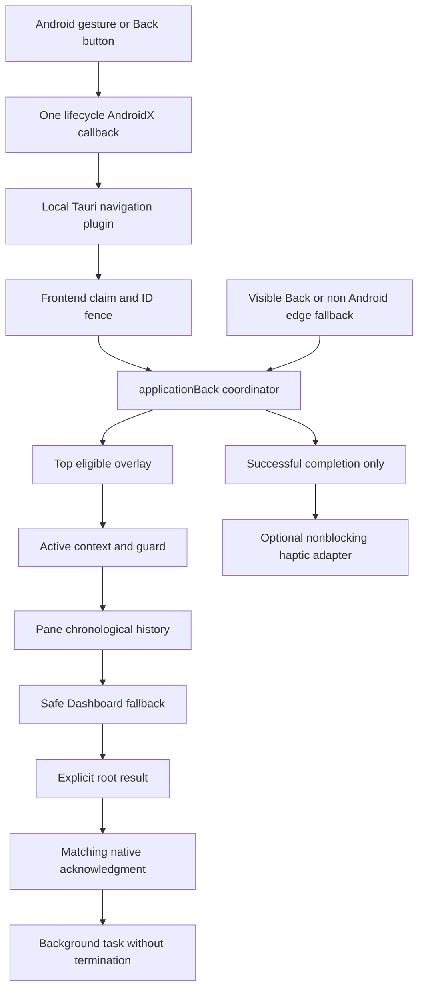

## Context

Investigation baseline: local `main`, commit `00a3831d3` (full revision is recorded in verification.md), 2026-10-09. See proposal.md for motivation. This document is a plan, not evidence of native reproduction or implementation.

### 1. Verified current state and root-cause boundary

| Surface | Evidence | Consequence |
|---|---|---|
| Android host | `MainActivity.kt` has lifecycle, permissions, intents, volume-key forwarding; no app Back callback. | No direct bridge to the application coordinator. |
| Tauri 2.11.5 | Registry `mobile/android-codegen/TauriActivity.kt` sets `handleBackNavigation=false`. `mobile/android/.../AppPlugin.kt` registers an enabled AndroidX callback: without `back-button` listeners, WebView `canGoBack/goBack`, otherwise disables itself and calls Activity `onBackPressed`; with listeners it emits `back-button`. | Tauri DOES handle Back. Missing general application integration, rather than absence of all native interception, is the confirmed gap. |
| Wry 0.55.1 | Cargo.lock pins 0.55.1; its exact-tag upstream `WryActivity.kt` conditionally registers URL-history Back, suppressed by Tauri's flag. Local registry has 0.54.1 only; do not present that older source as the locked runtime. | No second Wry handler is expected in this Tauri configuration. |
| Frontend | `MobileLayoutWrapper` listens to DOM `plethora:system-back`; repository search finds only listener/tests, no producer. `PodcastManager.tsx` separately installs `onBackButtonPress` while a podcast feed/player is active, bypassing the application coordinator. JS edge handler runs on native Android too. | DOM tests do not establish a native path. JS `preventDefault` cannot synchronously cancel an Android callback. |
| Coordinator | `applicationBack.ts` checks overlay, contextual, `goToPreviousTab`, returning boolean. | Good policy boundary; boolean means consumed, not necessarily completed. |
| History | `activeTabHistory` removes an existing ID before appending; `goToPreviousTab` always searches from length-2 without changing it. `goToNextTab` re-adds current to forward rather than to Back. `addTab`/singleton reuse/reopen do not consistently clear forward. | After A→B→C, Back selects B; next Back selects B again and returns false. A→B→A cannot retain chronological visits. Forward can ping-pong. |
| Residency | `applyResidentCap`, recently active reader queries and lazy mounting depend on MRU; `TabContent` independently tracks activated tabs and eviction. Back/Settings-return currently bypass eviction clearing. | Repurposing MRU as a stack breaks memory and mount semantics. |
| Settings | Handler registers unconditionally at priority 20; `attemptBack` always returns true, including when `returnFromSettings` finds Settings inactive. Async `modal.confirm` resumes a captured continuation. | Hidden Settings can swallow another view's Back. Deferred navigation can outlive ownership. |
| Visibility | `useIsActiveTab` is available; its provider is outside the frozen memo wrapper. | Context consumers receive visibility changes despite the memo freeze; still add a live store ownership check for the pre-render gap. |
| Overlays | Stack sorts priority then reverse registration; hooks unregister when closed; `useDialogFocus` integrates common Modal and MD3 dialogs. Some surfaces use separate hooks; no registry visibility/closing state exists. | Priority works for registered surfaces, but hidden owners and rapid dismiss-before-effect cleanup need explicit eligibility/claiming. Full coverage is not proven. |
| Startup/restoration | `MainLayout` restores, then focuses configured default via `addTab`; persisted tabs store currently saves tabs/panes/UI, not navigation stacks. `loadTabs` guards its async import against a nonempty workspace. | Seed after initialization; never infer chronology from MRU/tab order. Preserve the existing restore race guard. |
| Haptics | `useHapticFeedback` couples vibration to feedback sounds and visual effects. `soundService.vibrate('click')` is a best-effort 10ms browser vibration; no native haptic preference/service exists in current settings. `feedback/events.ts` explicitly excludes navigation; orchestrator implementation exists despite stale scaffolding comments. | Do not add navigation to domain notification vocabulary or call the visual/sound hook from Back. Add a small optional completion adapter. |

**Confirmed code defects:** missing native-to-coordinator path; nonadvancing, deduplicated traversal ledger; incorrect forward branching; unscoped Settings handler; inconsistent residency bookkeeping on history activation. **Reasoned runtime explanation:** with no application listener and no relevant WebView URL entry, Tauri's default reaches Activity behavior, leaving the foreground. Actual device/OEM behavior, callback ordering after lifecycle changes, resolved Gradle dependency graph and API-36 default handling remain validation obligations. No device reproduction has been claimed. URL entries from `shareLink`/`usePdfUrlState` can also divert native Back into a reader URL change instead of workspace history.

### 2. Version/API evidence

- Locked Rust: Tauri 2.11.5, tauri-runtime-wry 2.11.4, Wry 0.55.1. Installed JS API exports `onBackButtonPress`; package declaration is ^2.11.1. Match lockfiles, not latest examples.
- Declared Android: Activity KTX 1.10.1, AppCompat 1.7.1, WebKit 1.14.0, Kotlin 2.2.21, AGP 8.11.0, min 26, target/compile 36. Other plugins can raise the resolved Activity version; record `dependencyInsight` before native implementation.
- [Tauri app API](https://v2.tauri.app/reference/javascript/api/namespaceapp/#onbackbuttonpress): first-party Android interception exists since 2.9.0. It lacks request identity, acknowledgment and watchdog semantics.
- [Android predictive Back guidance](https://developer.android.com/guide/navigation/custom-back/predictive-back-gesture): use supported AndroidX dispatch; callbacks have ordered precedence; enabled interceptors affect system previews. Do not intercept KEYCODE_BACK or use deprecated Activity Back overrides.
- [AndroidX Activity releases](https://developer.android.com/jetpack/androidx/releases/activity): existing 1.10.1 supports the needed callback family; no upgrade selected. API-36 refinements in later releases do not justify an unrelated dependency bump.
- [Wry exact source](https://raw.githubusercontent.com/tauri-apps/wry/wry-v0.55.1/src/android/kotlin/WryActivity.kt) and local Tauri registry source establish the chain above.
- [Tauri mobile plugins](https://v2.tauri.app/develop/plugins/develop-mobile/) and existing `plethora-android-tts`/`plethora-folder-import` establish Rust shim → registered Kotlin plugin, IPC commands and lifecycle patterns.

## Goals / Non-Goals

**Goals:** one logical transition per committed input; data-preserving chronological traversal; fail-safe async transport; active owner isolation; incremental changes that remain usable before native wiring lands.

**Non-goals:** replacing tab/pane state with a router; mapping workspace Back onto browser URLs; native screen-preview animation; changing saved reader payloads; deleting hidden tabs to fix ownership; implementing generic draft protection for every feature. Existing dirty-state guards must be reused; newly discovered unguarded forms are separate work unless their existing Back path is affected.

## Decisions

### 3. Authoritative coordinator and result contract

Keep `requestApplicationBack(): boolean` as a compatibility facade over a richer synchronous entry point in the same module. Add `dispatchApplicationBack(input): BackDispatch`; it is the only policy implementation, not a second manager. Visible hierarchy Back uses the same entry point; Settings explicit app-return passes `intent:'leave-view'`, which bypasses only its subsection step and still observes overlay/dirty-state priority. Pure Forward uses the tab history action; it does not synthesize a Back input.

```ts
type BackInput = {
  source: 'android-system' | 'edge-fallback' | 'ui';
  id: string;                       // native epoch:sequence or UI generated ID
  intent?: 'hierarchy' | 'leave-view';
};
type BackDispatch =
  | { kind:'consumed'; outcome:'completed'|'pending'|'blocked'; transitionId?:string }
  | { kind:'root' }
  | { kind:'unavailable' };          // initialization/error; NEVER root
// pending optionally exposes a completion subscription/Promise to the adapter;
// it does not make the initial dispatch asynchronous.
// completed notification: { transitionId, changed:true, layer }
```

Registry migration contract (new rich results live in these existing modules; no separate policy store):

```ts
type LayerResult =
  | { kind:'declined' }
  | { kind:'completed'; completion?: Promise<{changed:boolean}> }
  | { kind:'pending'; token:string; completion:Promise<{changed:boolean}> }
  | { kind:'blocked' };
type ContextInput = BackInput & { paneId:string; tabId:string|null };
type Owner = { scope:'view'; paneId:string; tabId:string }
           | { scope:'global' };
type RegistrationOptions = {
  priority?:number; owner:Owner; isEligible?:()=>boolean;
};
// New overload: registerContextualBackHandler((input)=>LayerResult, options)
// Legacy overload: registerContextualBackHandler(()=>boolean, numericPriority)
// New rich overlay registration accepts ()=>LayerResult and options;
// old ()=>void callbacks are adapted by the shared open-state hook.
```

`declined` alone permits trying a lower tier. `completed` reserves one action and emits a successful-completion notification only after `changed:true`/committed closed or active state; `pending` reserves a token and emits completion only when its continuation returns `changed:true`; `blocked` consumes silently. Rejection/cancellation resolves or maps to `changed:false`, never fallthrough. Legacy contextual true is consumed without inferring a haptic-worthy completion; migrate all actual contextual production consumers (Settings and Podcast) to rich results. `useOverlayDismissal(open, onClose, priority)` retains its call signature, records view/global owner explicitly through an option/helper, and resolves its completion on actual close/unmount; direct common-dialog registration follows the same contract. Each logical surface registers once. The boolean facade generates a fresh UI input ID and invokes the rich coordinator. Settings context receives `intent` and implements leave-view only after top overlays/guard rules; it does not register a second bypass handler.

Consumption reserves the action: a pending prompt, non-dismissible overlay or closing transition consumes Back without a successful navigation haptic. Legacy boolean facade returns true for consumed; false for root/unavailable. Only the native transport may background after a current `root` acknowledgment. UI/browser/iOS root is a no-op; browser chrome Back remains governed by existing URL behavior.

Order is: eligible top overlay (including guard dialog) → active contextual owner → previous entry of owning pane → Dashboard safe fallback in that pane → root. Fullscreen exit is a contextual step after overlays and before workspace when native fullscreen has not already been handled by its native owner; observe the actual fullscreen change before reporting completion. Reader page/scroll/selection state is not silently converted into workspace entries. Existing explicitly registered transient reader surfaces can own a contextual step; URL page history remains separate.

No fallthrough after a layer reports pending/blocked. No handler is invoked twice to probe capability. If a handler throws, consume as blocked/unavailable, log a sanitized error, and recover; do not navigate underlying content. Root is established from current frontend state, never a native cached `canGoBack` bit.

Reentrancy and rendering: a synchronous mutation lock covers dispatch; mark an overlay as claimed/closing before calling its dismiss callback; hold a transition settle latch until React's affected owner reports committed state (fallback: next animation frame while foreground). Extra inputs during that short latch are consumed/blocked, not queued. A duplicate request ID returns its journaled result. Separate inputs after settlement traverse normally without a long arbitrary debounce. Maintain a bounded journal of 128 terminal IDs per frontend session; discard on session replacement. Native sequence is monotonic; old sessions are always rejected, so eviction of journal entries cannot enable replay.

Guarded Settings navigation reserves `{token, ownerTabId, paneId, source, expectedSection, navigationRevision}` before opening exactly one existing Modal. It returns pending immediately; no native transport waits for a human. While the prompt exists, Back cancels/dismisses it via the overlay tier; in the effect-registration gap, pending-guard logic cancels it directly. Cancel clears reservation and changes neither history nor draft. Confirm checks token, live owner, expected section and revision, then performs one current target resolution. Switching views, closing/moving the owner, external activation, reload or guard replacement invalidates the token; a stale confirmation never navigates a different screen. Backgrounding alone preserves a visible draft/prompt; no transition is executed while hidden—defer a confirmed continuation until resumed, then revalidate. Application-level listeners also fence older continuations during bridge recovery. Successful continuation emits completion once; initial prompt and its cancellation are silent.

### 4. Android ownership and bridge choice

Add local plugin `plethora-navigation`, keeping protocol/controller code out of generated Kotlin. Use the existing Rust thin-shim and `register_android_plugin` pattern; Android implementation accepts an `AppCompatActivity`. Non-Android commands return unsupported and are never called. Permissions live in a dedicated Android/main-webview capability, not the broad default capability with screenshot overlay/remote URLs.

A `NavigationBackController` owns one `OnBackPressedCallback(true)` for the Activity lifecycle. `MainActivity.onCreate`, immediately after `super.onCreate`, calls plugin controller `install(activity)`; install removes/re-adds its single callback as needed and is idempotent. Plugin `load(webView)` attaches delivery separately and ensures the controller is last among enabled app/Tauri callbacks if load occurs later. MainActivity's native wiring reserves startup Back before frontend registration. Do not modify generated TauriActivity, WryActivity, vendor AppPlugin, or permission/volume-key behavior. Record this MainActivity hand edit in Android build notes. Activity-scoped controller references are cleared on destroy; no static strong Activity/WebView reference survives recreation.

Tauri AppPlugin's enabled callback remains below this application-owned callback, but receives none of its actions: the new callback never delegates to it. Migrate the existing Podcast-only `onBackButtonPress` listener in `PodcastManager.tsx` to the shared active contextual registry before enabling this callback; no first-party native listener remains in parallel. Preserve its exact local hierarchy: close the playing-episode view, then return from selected feed to feed list, then decline to workspace history. Use owning tab/pane identity rather than its current first-pane type-only check; preserve existing playback/closing semantics. Overlay dismissal takes precedence over these Podcast steps, and both explicit controls and fallback/native Back use the same handler. Native picker/permission Activities and IME retain their own higher-priority system handling. Test callback precedence for startup, resume and plugin load; ensure reinstall cannot stack callbacks.

The callback consumes synchronously and returns immediately. It does **not** call dispatcher recursively, `super.onBackPressed`, `finish`, process exit, WebView `goBack` or blocking waits. All foreground activation actions honor a temporary root reservation: between a frontend root result and its ACK result, user activations are blocked and external intents are deferred. Recheck the navigation revision before sending root; if it changed, ACK consumed/blocked instead. Release reservation on ACK failure or recovery; after successful background, process deferred navigation on next foreground. Native `onNewIntent` invalidates any in-flight root authorization before processing the intent, so a warm external open cannot race a queued root ACK.

Kotlin then asynchronously delivers one `back-request` event through the plugin's listener transport. Root acknowledgment calls `activity.moveTaskToBack(true)` once, on the main thread, while resumed. If it returns false, stay foreground and show a localized failure/retry affordance; do not fall back to finish. This explicit policy preserves the task, reader/draft state and ongoing media. External shares/deep links do not change root into return-to-source-app behavior.



### 5. Protocol, timing and recovery

Plugin IPC commands: `attach`, `claim`, `acknowledge`, `detach`; Rust names snake_case where necessary and native methods camelCase. `attach` is called only after one listener is installed and the workspace/coordinator bootstrap is ready. It returns an opaque native epoch and protocolVersion=1, replacing any previous frontend session atomically. Use plugin `addPluginListener`/`trigger` (supported by the pinned Plugin base), not DOM events or a new JavaScriptInterface. Kotlin command processing, callback state and timeout handling run on the main thread.

```ts
type Request = { protocolVersion:1; epoch:string; sequence:number; id:string };
// attach({clientSessionId}) => {protocolVersion:1, epoch}
// claim({epoch,id}) => {accepted:boolean, expiresAtEpochMs?:number, remainingMs?:number}
// acknowledge({epoch,id,kind:'consumed'|'root'|'unavailable',
//              outcome?:'completed'|'pending'|'blocked', transitionId?:string})
// => {accepted:boolean}; duplicates are idempotent, conflicting ACKs rejected
// detach({epoch}) => void; stale epoch is a no-op
```

A request is QUEUED until claimed. Native deadline is 1500ms from request dispatch, using `SystemClock.elapsedRealtime`; expiry checks do not rely on wall time. `claim` verifies epoch, in-flight ID, resumed state and unexpired deadline, moves to CLAIMED, and returns the remaining time plus a wall-clock expiry as an extra frontend stale-response fence. Frontend checks current session, request journal, document visibility, positive remaining time and wall expiry immediately after the claim Promise resolves; calculate a local `performance.now` deadline using remaining time and also reject wall-clock anomalies relative to the request-receipt timestamp (compare wall elapsed with performance elapsed; drift above 100ms rejects the response). These checks never authorize backgrounding. A late claim rejection cannot invoke the coordinator. For an accepted claim, invoke the coordinator synchronously without another await, journal its result, then acknowledge immediately. The adapter's await/catch path must not interpret a failed ACK as an unhandled Back.

For delayed claim responses, native cancellation may race the accepted response. Preserve the at-most-once bound through the frontend journal and synchronous mutation lock. Timeouts do not imply non-execution: if an already claimed request completed but its ACK was lost, keep that possible single transition and never replay it or use timeout to exit. The user can retry a **new** Back only after recovery reconnection/state settlement; frontend never retries a request ID automatically. This is deliberately fail-safe rather than pretending asynchronous cancellation is instantaneous.

Native accepts `root` only for the current claimed ID, before deadline, same epoch, resumed Activity and healthy attached session. All other root ACKs are ignored. `consumed/pending` closes native transport immediately; the frontend owns the user's dialog duration and token. There is no native 1500ms deadline on a user's decision. Native gate drops/coalesces callbacks while a request is in-flight; it never queues Back actions that could run after a dialog disappears.

```mermaid
sequenceDiagram
  participant OS as Android
  participant N as Native controller
  participant J as Frontend adapter
  participant C as Coordinator
  OS->>N: committed Back
  Note over N: consume synchronously; one ID; start watchdog
  N-->>J: back-request(epoch, id)
  J->>N: claim(epoch, id)
  N-->>J: accepted lease or rejected
  J->>C: synchronous dispatch if claim valid
  C-->>J: completed / pending / blocked / root
  J->>N: acknowledge result for same ID
  alt consumed
    Note over N: close transport; stay foreground
  else valid root
    N->>N: moveTaskToBack(true)
  else deadline or protocol failure
    Note over N: expire; never infer root; recovery UI
  end
```

| Native state | Input | Result |
|---|---|---|
| STARTING | Back | Consume; do not queue replay. After a 5s foreground startup grace, show recovery choices if still unready. |
| READY | committed Back | Allocate sequence, send request, enter IN_FLIGHT, deadline 1500ms. |
| IN_FLIGHT | additional callback | Consume/drop; no new ID or transition. |
| IN_FLIGHT | claim/ACK invalid ID/epoch | Reject; do not mutate or extend deadline. |
| IN_FLIGHT | consumed ACK | Cancel timer, record terminal ID, return READY. |
| IN_FLIGHT | root ACK | Cancel timer; background once; enter SUSPENDED through lifecycle. |
| IN_FLIGHT | unavailable/timeout/dispatch error | Expire request; enter RECOVERING; no native default Back. |
| RECOVERING | Back | Show/focus one native recovery dialog; never stack dialogs or replay requests. |
| RECOVERING | fresh successful attach | New epoch, READY; discard expired IDs and recovery dialog. |
| any | Activity stop/destroy, WebView/session replacement | Cancel timer, invalidate session/request; SUSPENDED/STARTING; destroy removes callback/listeners/references. |
| SUSPENDED | resume | Reattach/probe listener with fresh epoch before READY; preserve tab/draft state. |

Recovery dialog (native, accessible/localized because JS may be unavailable): “Back navigation is temporarily unavailable.” Actions **Retry connection** (fresh handshake, no automatic replay/navigation/reload), **Stay** (dismiss, still recovering), **Background app** (explicit user choice; background only, no termination). Native dialog Back acts as Stay. A failed retry remains bounded and shows the same choices. Resume/root buttons remain usable without waiting for JS. Timeout closes the protocol transaction; it does not hold the dispatcher or Activity forever. If JS reconnects while the recovery dialog is visible, dismiss it without forwarding its pending Back. Logs record IDs, timing and result only; no document titles, contents or user secrets.

Install listener once at root shell lifetime, independent of phone/tablet width and fullscreen. Async registration cleanup must unregister a late-resolving listener after unmount; detach with its exact epoch so old cleanup cannot tear down a newer attachment. Initialization retry occurs on explicit Retry and resume, not a polling interval. Replace DOM `plethora:system-back` listener as the native path; if retained for tests/legacy hosts, make it a disabled-on-Android adapter into the same coordinator and document that DOM cancellation is only local to that host.

### 6. History model and invariants

Keep `activeTabHistory` unique MRU; remove `forwardTabHistory` as independent runtime storage (its navigation reads are in `tabsStore`; `MarketingCaptureHost` also directly seeds it and must migrate its fixture setup), updating tests/types together. Add versioned `navigationByPane: Record<paneId,{back:string[], current:string|null, forward:string[]}>`. Both arrays are oldest-to-newest, top at end; repeated nonadjacent IDs are allowed. Root pane tree remains source of truth for tab existence/membership. `current` equals that pane's activeTabId after every atomic mutation. Native Android mobile uses first visible tab pane, matching the shell; wide tablet/desktop uses focused/last-interacted visible pane. Add runtime-only `navigationPaneId` in tabsStore, set by `Tabs` pane focus/pointer capture and ordinary activation. Select first valid visible pane if it is absent. Do not replace unrelated `MainLayout.activePaneTabId` behavior; align its pane-focus event with this pointer.

Tab content exposes owning tab identity through a new `TabIdContext/useTabId` next to existing pane/active context. Handlers resolve eligibility against current pane/tab IDs, not MRU. Wide split panes may each have visible tabs, but only the navigation-owning pane's contextual handlers consume global Back. A visible global portaled Modal remains eligible regardless of pane; local overlays require their owner's eligibility.

Every foreground activation calls one store-internal transition reducer, including `setActiveTab`, `addTab` creation/reuse, `reopenLastClosedTab`, Settings return, moves/splits/spawn/collapse and startup finalization. Preserve existing public action names. Use an internal activation mode (`visit|back|forward|replace|bootstrap`) so caller double-activation of the same ID is a no-op and Back never pushes itself as a new visit. Validate tab ID membership before any update. Update pane, stacks, MRU, eviction-clearing/cap and navigation revision in one Zustand set; use existing debounced persistence. Never notify subscribers with inconsistent active/stacks state.

```ts
visit(pane, target):
  if target == current: return unchanged; // keep forward branch intact
  if valid(current): back.push(current)
  current = target; forward = []
back(pane):
  pop invalid/closed/moved entries and entries equal to current
  if no valid target: prune invalid entries only; return false
  forward.push(current); current = target; return true
forward(pane):
  pop invalid/closed/moved entries and entries equal to current
  if no valid target: prune invalid entries only; return false
  back.push(current); current = target; return true
```

Bound each array to 256 entries, drop oldest entries only; this is the documented retained chronology window. No Set/unique filtering except adjacent/current invalidation and MRU. Entries are tab identities, not reader page snapshots; revisiting restores that tab's latest saved/current reader state, not a historical scroll version. MRU receives each activation even during Back/Forward; it never loses other residency entries because of traversal. Clear destination's eviction marker and run existing caps; use existing reader persistence/unsafe-to-evict protections. Do not remount purely to navigate.

Examples (B/F show stacks with top at right):

| Action | B | current | F |
|---|---|---|---|
| A→B→C→S | A,B,C | S | empty |
| Back from S menu | A,B | C | S |
| Back | A | B | S,C |
| Back | empty | A | S,C,B |
| Forward | A | B | S,C |
| visit D | A,B | D | empty |
| A→B→A→C then Back | A,B | A | C |
| then Back | A | B | C,A |

Closing a background tab removes **all** its entries from both stacks, leaves current and forward branching otherwise intact. Closing current applies the existing pane-local MRU/sibling replacement policy, removes all closed-ID entries, and replaces current without appending a visit; remove trailing Back entries equal to replacement, retain other entries. Pane removal drops its navigation record; moved tabs' entries are pruned in source, destination foreground activation is a visit; purely background move is not a visit. Split/spawn copies no fabricated chronology: new pane starts at its selected tab; source current replacement uses replace. Collapse retains surviving pane history and prunes membership; do not merge MRU sequences into chronological history. Bulk closes use the same normalization. Reopen records a fresh visit; removed old entries are not resurrected.

`getSettingsReturnDestination` peeks the Settings owning pane's Back stack (skipping invalid/current/Settings entries) and otherwise resolves Dashboard. `returnFromSettings` consumes that same portion of Back and pushes Settings once onto Forward, using history activation bookkeeping. This preserves prior “non-Settings location” wording while making repeated exit from Settings chronological. It must return false if Settings is not active/owned. Explicit app-return is routed through the coordinator/guard, not duplicated in the button. A closed destination is resolved again at confirmation time; navigationRevision fencing prevents confirmation from overriding intervening activation.

Root fallback: when Back is exhausted and current is not Dashboard, activate/create singleton Dashboard via a synchronous canonical tab factory from `TabRegistry`, in `replace` mode. Keep Back empty; optionally push the departed current onto Forward once so explicit Forward can retrace it. Do not use the asynchronous `navigate` DOM event and report a transition before activation exists. Dashboard→root has no history entry returning to the fallback source, avoiding a loop. If a contextual dirty guard blocks leaving, root fallback cannot run. At Dashboard with no eligible layers/history, return root. Browser/iOS explicit root Back stays there. A later user visit from Dashboard is ordinary history.

Serialization: extend existing workspace JSON with `navigation:{version:1,byPane}` only; no database migration. Restore only records belonging to restored panes/tabs; normalize/cap/validate strings, arrays and `current`, rejecting unsupported versions. Old snapshots without navigation seed each pane from its activeTabId with empty stacks; do not infer visits from saved tab order/MRU. Keep MRU startup seed and lazy-mount semantics separate. MainLayout's bootstrap default-view focus is `bootstrap` and replaces restored current while pruning self destinations, retaining valid restored history; initialization's Dashboard/default creation must not invent user visits. Cold deep-link/share destination then either performs an actual foreground visit after bootstrap or, if it is the initial selected view, starts with empty Back and Dashboard fallback. Warm external opens record one visit via canonical addTab; background imports/failed intents create none. Preserve `loadTabs`' async race guard. `useShareTarget` and route handlers keep importing/deduplicating as before; record only activation, not receipt/import processing.

### 7. Overlay and active-context contracts

Extend registries with optional live `isEligible` and owner metadata, maintaining numeric-priority compatibility. A shared `useContextualBack` helper reads `useIsActiveTab`, `usePaneId`, `useTabId`; registers only while active and validates owner with store at dispatch time. Settings migrates to it. Cleanup/re-register does not reorder active overlays unnecessarily; hooks hold latest callbacks/eligibility in refs. Global handlers must explicitly declare global scope, not inherit a default true that masks missing identity.

Overlay ordering remains descending priority then latest visual registration; align priority bands with existing stacking tokens: top global modal 100, bottom/menu modal 100 with recency tie, transient drawer 30–40, viewer popover/selection lower. Nested children register after their parent. Reopening refreshes ordering; callback prop changes alone do not. The shared `ContextMenu.tsx` and `MobileContextMenuSheet.tsx` currently handle Escape/click but do not register with overlayStack; integrating them is required, not an optional audit finding. Register each logical menu once at the ContextMenu owner. Mobile submenu Back invokes the existing depth-pop/onClose contract once, then closes the outer sheet on a later input; nested desktop flyouts remain visually ordered. Apply owner scoping and visible-trigger focus restoration through `useSurfaceMenu`.

Audit priority against actual visual elevation for modal plus More menu; no sorting change silently makes a behind-modal surface dismiss first. Stack entry result differentiates `dismissed|pending|blocked`; a non-dismissible top overlay blocks, never falls through. Already-closing top entries block until gone. One logical surface must not register twice through a primitive plus local hook. Audit native/browser dialogs separately; a native OS dialog owns Back before app Activity dispatch. `useDialogFocus` restores focus to still-connected visible invoker or active view heading, not a hidden cached tab. Selection/annotation dismissal does not discard the draft; retain existing cancellation/save guard where present.

### 8. Predictive Back and gesture ownership

Retain existing AndroidX versions, enable predictive routing explicitly for MainActivity via `android:enableOnBackInvokedCallback="true"`; inspect the merged manifest, including plugin overrides. Use `handleOnBackStarted/Progressed/Cancelled` only for a native gesture token, with no workspace mutation or haptic. `handleOnBackPressed` commits once. Three-button Back enters the same commit path without progress. Do not register a separate platform callback, key listener or JavaScript touch recognizer. The pinned AndroidX dispatcher bridges supported platform versions.

Selected trade-off: always-on interception is conservative while asynchronously establishing app root, so full OS back-to-home/cross-task predictive preview is not promised. No fake in-app progress animation or JS preview is added. Cancellation leaves state unchanged; committed Back uses normal app transition; root backgrounds explicitly. Allowing the OS default at a cached root could restore previews, but stale async capability data can prematurely exit and Tauri's lower callback still intercepts. That optimization is explicitly deferred. Document the limitation; real API 33/34/35/36 tests must verify cancel/commit, not confuse correct dispatch with full visual preview support.

Disable `useEdgeSwipeBack` based on `nativePlatform()==='android'`, not viewport or a mobile UA; this includes wide native tablets/fullscreen and remains disabled even during bridge failure. Browser/PWA Android continues fallback left-edge recognition; iOS retains current narrow edge hook/guards (fullscreen disabled). Scope the earlier edge spec accordingly. OS gestures can start at either Android edge; the no-right-edge-forward rule prohibits application tab cycling, not OS right-edge Back. Preserve system gesture exclusion behavior; no whole-screen exclusion rect or preventDefault hack. Content gestures starting outside OS-owned regions remain content-owned (Library horizontal scroll, EPUB/PDF paging, review swipes, queue rows, selection, annotation); existing local exclusion regions remain narrow and require on-device validation.

### 9. Optional haptics

Add `navigationFeedback.ts` with `notifyNavigationCompleted({transitionId,layer})`; called once by the coordinator when the action actually changes UI/workspace, including confirmed continuation, never by both bridge and UI. Exclude cancelled/blocked/pending/root/background/transport failures and discard-confirmation dismissal. Deduplicate bounded recent transition IDs; feedback failure never affects navigation/ACK.

Adapter uses a registered native haptic selection effect when a future service provides it; otherwise `soundService.vibrate('click')`, gated by existing `notifications.feedbackSoundsEnabled` (legacy coupled opt-in, default off) and `supportsHaptics`, unless a separate haptic preference has already been introduced by the other change. Re-read settings at completion. Unsupported system preference detection means best-effort no-op rather than a claim to override system settings. No new haptics plugin/dependency or settings control here. Future native service must respect OS haptic settings without ignore-setting flags. Do not call `useHapticFeedback.click()` (it adds sound/visual effects), and do not add a navigation event to `FEEDBACK_EVENT_IDS`; the unified notification change intentionally keeps navigation out of domain notifications. A service injection point permits the independent native-haptics upgrade to land in either order.

### 10. Performance, lifecycle and security

History operations are bounded by 256 entries and existing pane/tab counts; no document serialization inside the native callback or touchmove. Reuse debounced save and cap logic; focused ID/stacks do not subscribe all reader components. Kotlin callback does O(1) state work/event enqueue, with IPC off the synchronous callback; timers/main-thread commands never sleep or block. No additional global listeners per cached tab; no polling; epoch/journal memory bounded. Run the local benchmark/bundle gate before implementation release, without silently relaxing budgets.

Plugin permissions restrict attachment/claim/ACK/detach to local trusted main WebView and approved dev origin only via a separate dev capability; no screenshot-overlay or arbitrary remote origin. Keep explicit protocol version, bounded ID lengths, allowed enum values and integer sequence validation on Rust/Kotlin boundaries. Events are transport, not authorization: matching claim/session/current request is mandatory. Don't accept a forged DOM event as native root permission. No dynamic document/user text in evaluated script (the chosen transport uses plugin events/commands), raw JS interface, or remote content binding. Handle detach races with epochs; Activity/session recreation generates new epochs, never persists in-flight IDs. Keep media, volume, permission and incoming-intent integrations operational.

### 11. File-level implementation map

| File/module | Intended work | Key verification |
|---|---|---|
| `src/stores/tabsStore.ts` | per-pane chronological reducer; all activation/mutation paths; MRU/eviction retained; additive restore | history table, close/reopen/split, singleton, saved legacy/versioned JSON, resident cap tests |
| `src/components/tabs/TabRegistry.tsx` | reusable synchronous canonical Dashboard factory | no event-only success or duplicate singleton |
| `src/components/common/Tabs/TabContent.tsx`, `Tabs.tsx` | owner identity context, pane focus pointer, context under memo freeze | cached Settings/reader preservation, active pane isolation |
| `src/lib/applicationBack.ts`, `contextualBack.ts`, `overlayStack.ts` | structured results, eligibility/claim/settle, dedupe, completion | unit/integration priority, exceptions, rapid inputs |
| new `src/hooks/useContextualBack.ts`; `useOverlayDismissal.ts`, MD3 Dialog | owner-scoped lifetime and live checks | hidden owner and effect-gap tests |
| `src/components/settings/SettingsPage.tsx` | same coordinator for buttons/native/hierarchy, single pending token | confirm/cancel/stale continuation and direct app return |
| `src/components/common/Modal.tsx`, `ContextMenu.tsx`, `MobileContextMenuSheet.tsx`, `useSurfaceMenu.ts`, selection overlays, `MobileNavigation.tsx`, adaptive sheets | shared overlay ownership/block/closing/focus where audit shows gaps | stacked surfaces, protected drafts/accessibility |
| `src/components/media/PodcastManager.tsx` | replace feature-local native listener with active contextual player→feed→list handler | Podcast hierarchy, overlay priority, hidden tab, both modalities |
| `src/components/dev/MarketingCaptureHost.tsx` | seed new history fixture without obsolete forward state | marketing capture fixture initializes coherently |
| `src/components/layout/MainLayout.tsx`, route/intent activation paths | bootstrap readiness/activation modes, focused pane alignment | restore race, default view, deep link/warm share |
| new `src/lib/nativeBackBridge.ts`; `MobileLayoutWrapper.tsx` | one Android listener/session/claim/ACK; teardown; disable Android JS edge | platform/fullscreen/tablet matrix, fake clock/transport |
| `src/hooks/useEdgeSwipeBack.ts` | preserve recognizer; only documentation/options as needed | existing protected target/mid-screen tests |
| new `src/lib/navigationFeedback.ts` | completion-only injectable optional haptic | disabled/unsupported/dedupe/cancel/throw |
| new `src-tauri/plugins/plethora-navigation/{Cargo.toml,build.rs,src/lib.rs,android/...}` | Rust commands/Android controller/native tests/resources/permissions | fake transport state machine, lifecycle, R8 release |
| `src-tauri/{Cargo.toml,src/lib.rs,capabilities/...}` | register local plugin Android-only; narrow ACL | unsupported platforms build; remote invoke denied |
| `src-tauri/gen/android/.../MainActivity.kt`, manifest | earliest app-owned callback wiring, predictive flag | real dispatcher order and merged manifest |
| `docs/android-build-notes.md` | regeneration procedure, back policy and preview limitation | regeneration keeps plugin and restores Activity edits |
| new tests + device verification record | matrix in validation.md | no browser simulation substituted for device proof |

### 12. Alternatives evaluated and existing OpenSpec reconciliation

| Alternative | Why not selected |
|---|---|
| Only wire `onBackButtonPress` first-party API | Correctly suppresses native default once registered and is the smallest happy-path fix, but exposes no native request IDs/ACK deadline, permits startup before registration, and cannot implement native recovery when JS is missing. Existing Podcast use proves the API works in one feature, not that the general contract exists. |
| DOM event with `preventDefault` | Cancellation applies to JS dispatch only; native callback and async IPC have already returned. |
| Activity `evaluateJavascript` return-value callback like volume bridge | Can carry an initial result, but does not provide an authenticated session/claim lifecycle itself; would require rebuilding that protocol around ad hoc script globals. Reuse standard local-plugin transport instead. |
| Conditional interception from cached capability/root state | Stale frontend/native state can exit despite a new overlay/history destination; Tauri's underlying enabled callback also prevents simple root preview delegation. Defer optimization. |
| Global native KEYCODE_BACK/onBackPressed override | Unsupported as primary interception under API-36 predictive routing; misses system gestures. |
| Convert MRU to a conventional stack | Destroys unique residency/eviction bookkeeping and still lacks reliable chronological repeated visits. |
| URL-router or `window.history.back` replacement | Workspace identity, reader URL state, overlay lifetime and Settings hierarchy are separate; unnecessarily rewrites navigation and risks WebView exit. |
| New global full-width swipe / Android JS edge race | Competes with OS gestures and content interactions; dual delivery cannot reliably identify one OS gesture. |
| Timeout → native exit or cached root fallback | Missing ACK cannot establish absence of a valid destination; data-loss and premature-background risk. Explicit native recovery preserves exit access. |

Existing changes:

- `fix-mobile-edge-swipe-back`: left-edge-only JavaScript recognizer and no global tab cycling are retained on fallback surfaces. Amend its still-unarchived delta to scope JavaScript rules to browser/PWA/iOS; explicitly allow Android OS Back at either edge. Its unchecked real-device task remains unchecked. This change owns native dispatch; no second recognizer.
- `fix-settings-return-navigation`: retain visible control, compact hierarchy, non-Settings destination, dirty prompt and localization requirements. Supersede only its design decision to use MRU as traversal/return source with §6; no duplicate requirement set or separate return snapshot. Existing spec is behaviorally compatible once gesture scenarios are understood as platform-owned Back/fallback dispatch.
- `improve-mobile-tauri-ui`: keep responsive shell, safe-area and overlay tokens; do not use layout width to install/remove Android bridge.
- `fix-mobile-layout-and-android-media-controls/application-overlay-stacking`: keep portal/elevation/focus contract, adding active ownership and one-dismiss behavior here.
- `fix-tab-navigation-focus`, residency/performance work and `navigation-layout-reader-interaction`: preserve pane focus, activation reuse, lazy mounting, residency guards and restore payloads. Run their existing tests as regressions.
- `unify-notifications-and-sound`/`sound-effects-ux`: optional navigation micro-haptic adapter is outside notification vocabulary; no audible navigation event or notification permission changes.
- `mobile-lifecycle-webview-reliability`: a proposal alone does not prove lifecycle resilience; the epoch/attach protocol is self-contained and does not depend on that change being completed.

## Risks / Trade-offs

- [Callback order or API-36 routing differs from source expectations] → instrument dispatcher at startup/resume; require merged manifest/dependency evidence and API-36 device commit/cancel; repair registration order within the chosen single-callback design, never silently activate both routes.
- [Timeout cannot prove a claimed action did not execute] → no timeout-driven exit/replay; explicit recovery, dedupe and one synchronous dispatch per ID. An ACK timeout may accompany one already-completed transition; this is safe and documented.
- [Full predictive root preview unavailable under always-on interception] → disclose limitation, support cancellation/commit correctly, defer stale-capability optimization.
- [Hidden overlay or pending prompt overrules another owner] → live owner checks plus token invalidation, registry claims and component tests before native enablement.
- [History changes residency or restoration costs] → separate ledger, shared activation path, bounded stacks, legacy snapshot fixtures and benchmark/bundle gate.
- [Future haptic service interface differs] → tiny injectable adapter; default existing no-op/best-effort behavior, not a dependency.
- [Generated native wiring overwritten] → local plugin plus explicit hand-edit documentation and regenerated-build check.

## Migration Plan

1. Establish baseline tests and add failures for history/hidden ownership; change shared store/coordinator first while retaining boolean facade.
2. Add scoped context/overlay and Settings continuation fixes; verify browser/iOS fallback gestures and persisted workspace compatibility.
3. Add native plugin/controller with tests and minimal host wiring behind an internal Android-only enable switch; ship frontend bridge in the same build. Disabled switch explicitly restores prior behavior for rollback testing, not a release fix.
4. Run validation.md automated/local gates and real-device matrix; only then enable by default and record rollout evidence. Plugin + bridge rollback must be atomic; additive JSON is safe for older readers.

## Open Questions

No architectural decisions are left to implementation. Device/OEM callback timing, resolved Gradle version and available test hardware are empirical checks with fixed acceptance/fallback above; unsupported or unverified required platform coverage blocks release, not completion of this proposal.
