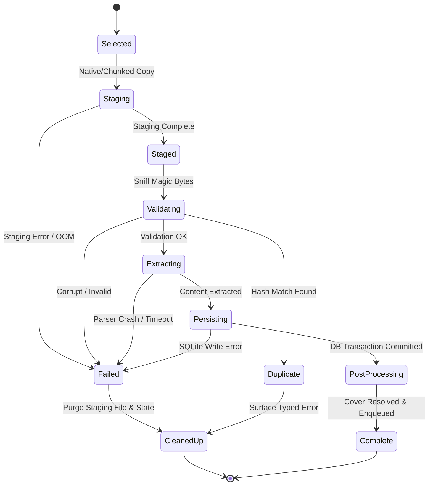

# Design: Document Import Pipeline Hardening and Unification

## 1. Canonical Backend Pipeline Architecture

All document import mechanisms converge onto a unified, canonical backend execution path. No entry point bypasses the validator, transactional persistence, or cleanup handlers.

```text
┌─────────────────────────────────────────────────────────────────────────────┐
│                            Import Entry Points                              │
│                                                                             │
│  ┌──────────────┐   ┌──────────────┐   ┌──────────────┐   ┌──────────────┐  │
│  │ Desktop File │   │ Mobile File  │   │ iOS Share    │   │ Mobile/Desk  │  │
│  │ Dialog / D&D │   │ SAF / Picker │   │ Extension    │   │ Folder Import│  │
│  └──────┬───────┘   └──────┬───────┘   └──────┬───────┘   └──────┬───────┘  │
│         │                  │                  │                  │          │
│         ▼                  ▼                  ▼                  ▼          │
│  ┌──────────────┐   ┌──────────────┐   ┌──────────────┐   ┌──────────────┐  │
│  │ Direct Path  │   │Bounded Chunk │   │App Group /   │   │Native Staged │  │
│  │ Canonicalize │   │Staging (256K)│   │Staged Copy   │   │Recursive Path│  │
│  └──────┬───────┘   └──────┬───────┘   └──────┬───────┘   └──────┬───────┘  │
│         │                  │                  │                  │          │
└─────────┼──────────────────┼──────────────────┼──────────────────┼──────────┘
          │                  │                  │                  │
          ▼                  ▼                  ▼                  ▼
┌─────────────────────────────────────────────────────────────────────────────┐
│               Canonical Rust Import Engine (import_from_path)               │
│                                                                             │
│  ┌───────────────────────────────────────────────────────────────────────┐  │
│  │ 1. Sniff & Validate (magic bytes, MIME match, extension sanity)       │  │
│  ├───────────────────────────────────────────────────────────────────────┤  │
│  │ 2. Duplicate Detection (fast content-hash comparison)                 │  │
│  ├───────────────────────────────────────────────────────────────────────┤  │
│  │ 3. Isolated Content Extraction (spawn_blocking with timeout & catch)  │  │
│  ├───────────────────────────────────────────────────────────────────────┤  │
│  │ 4. Transactional SQLite Persistence (Atomic Document + Metadata write)│  │
│  ├───────────────────────────────────────────────────────────────────────┤  │
│  │ 5. Post-Processing & Cover Resolution (Non-blocking asset cache)      │  │
│  ├───────────────────────────────────────────────────────────────────────┤  │
│  │ 6. Staging Cleanup & Tag Queue Dispatch                               │  │
│  └───────────────────────────────────────────────────────────────────────┘  │
└─────────────────────────────────────────────────────────────────────────────┘
```

---

## 2. Deprecation of Large JSON IPC Transfers

### Problem:
The legacy `import_document_from_bytes` command takes `file_bytes: Vec<u8>`. In Tauri on mobile (and WebKit/Android WebView), `Vec<u8>` deserializes from a JSON array of JavaScript numbers:
- A 20 MB PDF turns into a ~120 MB JSON string in memory.
- An 80 MB EPUB or audiobook causes immediate V8/WebKit memory pressure and triggers Jetsam/OOM termination on iOS.

### Solution:
1. **Bounded Chunked Staging**:
   - Files picked via HTML5 file input or streamed over IPC are transferred in fixed 256 KB slices via `stage_import_file_start` and `append_import_file_chunk`.
   - Each chunk payload is tiny, bounded, and immediately written to disk in `<app_data>/imports/`.
2. **Native Staging (`FolderImportPlugin`)**:
   - On iOS and Android, native pickers copy selected files directly to `<app_data>/imports/` at the OS level (`asCopy: true`), passing only safe filesystem paths back to Rust.
3. **Deprecation**:
   - Remove all frontend usages of whole-file `import_document_from_bytes`.

---

## 3. Import Lifecycle State Machine



### Invariant Guarantee:
Every non-terminal transition is protected by a structured cleanup handler. If the pipeline transitions to `Failed`, any temporary files on disk are unlinked and no orphan rows remain in SQLite.

---

## 4. Typed Import Error Hierarchy

Replace ambiguous `PlethoraError::NotFound` errors with a dedicated `ImportErrorCode` enum in Rust and TypeScript:

```rust
#[derive(Debug, Clone, Serialize, Deserialize, PartialEq, Eq)]
#[serde(rename_all = "snake_case")]
pub enum ImportErrorCode {
    UnsupportedType,
    FileNotFound,
    PermissionDenied,
    StagingFailed,
    InvalidDocument,
    EncryptedDocument,
    ExtractFailed,
    DuplicateDocument,
    StorageFull,
    PersistFailed,
    Cancelled,
    Interrupted,
    Internal,
}

#[derive(Debug, Clone, Serialize, Deserialize)]
pub struct ImportError {
    pub code: ImportErrorCode,
    pub message: String,
    pub file_name: String,
    pub details: Option<serde_json::Value>,
}
```

### Frontend User-Facing Error Mapping:

| Error Code | User-Facing Message | UI Action |
|---|---|---|
| `duplicate_document` | "This document has already been imported as '{title}'." | Focus existing document |
| `encrypted_document` | "This file is password-protected or encrypted and cannot be opened." | Dismiss dialog |
| `invalid_document` | "The file appears to be damaged or not a valid {format} file." | Offer retry |
| `unsupported_type` | "The file type '.{ext}' is not supported by Plethora." | Show supported formats |
| `storage_full` | "Device storage is full. Please free up space and try again." | Show storage alert |
| `extract_failed` | "Could not extract text from this document, but it was saved." | Open as raw document |

---

## 5. Transactional SQLite Persistence

Document creation is restructured to execute within a single SQLite transaction:

```rust
pub async fn create_document_transactional(
    pool: &SqlitePool,
    doc: &Document,
    initial_extracts: &[Extract],
) -> Result<Document> {
    let mut tx = pool.begin().await?;
    
    // 1. Insert document record
    insert_document_tx(&mut tx, doc).await?;
    
    // 2. Insert initial extracts (if any)
    for extract in initial_extracts {
        insert_extract_tx(&mut tx, extract).await?;
    }
    
    // 3. Insert audit/provenance log
    insert_provenance_tx(&mut tx, &doc.id, &doc.metadata).await?;
    
    tx.commit().await?;
    Ok(doc.clone())
}
```

If any step fails, the entire transaction rolls back automatically.

---

## 6. Stale Staging Sweeper

To prevent orphaned staging files from accumulating on devices (e.g. if the app is killed by the OS mid-staging):

- On application startup (`main.rs` initialization):
  - Scan `<app_data>/imports/` and `<app_data>/imports/share-extension/`.
  - Delete any files with modification timestamps older than 24 hours that are not referenced in the `documents` SQLite table (`file_path`).

---

## 7. Robustness Fixture Corpus Specification

Committed under `src-tauri/tests/fixtures/documents/`:

### PDF Corpus:
- `pdf-minimal-valid.pdf`: 1-page standard text.
- `pdf-large-multi-page.pdf`: 100+ pages with table of contents.
- `pdf-scanned-image-only.pdf`: Scanned pages without embedded text.
- `pdf-password-encrypted.pdf`: Encrypted with standard user password.
- `pdf-corrupt-header.pdf`: Truncated header bytes (`%PDF-` replaced with garbage).
- `pdf-truncated-body.pdf`: Valid header, truncated mid-stream.
- `pdf-exotic-cff-fonts.pdf`: Fonts that trigger CFF font parser panics in older crates.
- `pdf-huge-dimensions.pdf`: Pathological page dimensions (10,000 x 10,000 pt).
- `pdf-renamed-exe.pdf`: Windows binary renamed with `.pdf` extension.

### EPUB Corpus:
- `epub-minimal-valid.epub`: Simple 2-chapter valid EPUB 3.
- `epub-large-spine.epub`: 150+ small chapters in spine.
- `epub-missing-container.epub`: ZIP archive missing `META-INF/container.xml`.
- `epub-broken-opf.epub`: Malformed XML in package document.
- `epub-missing-manifest-item.epub`: Spine references item absent from manifest.
- `epub-huge-embedded-image.epub`: 50 MB uncompressed image entry in ZIP.
- `epub-malformed-xhtml.epub`: Unclosed tags, invalid entity references.
- `epub-renamed-text.epub`: Plain text file renamed with `.epub` extension.

### Text / Markdown / HTML:
- `text-empty.txt`: 0-byte file.
- `text-whitespace-only.txt`: 100 KB of spaces and tabs.
- `text-unicode-cjk-emoji.txt`: Multilingual UTF-8 text with complex glyphs.
- `text-long-line.txt`: Single 2 MB line without line breaks.
- `html-deeply-nested.html`: 2,000 nested `<div>` tags.
- `html-unclosed-tags.html`: Malformed HTML with dangling tags.

### Filenames:
- `spaces and tabs in file name.pdf`
- `emoji-🎉-book-📖.epub`
- `quotes-"and"-apostrophes'.md`
- `unicode-nfc-café.pdf` vs `unicode-nfd-café.pdf`
- `very-long-filename-` (255+ characters).pdf
- `multiple.dots.in.name.v1.0.pdf`
- `UPPERCASE_EXTENSION.PDF`
- `extensionless_document`
