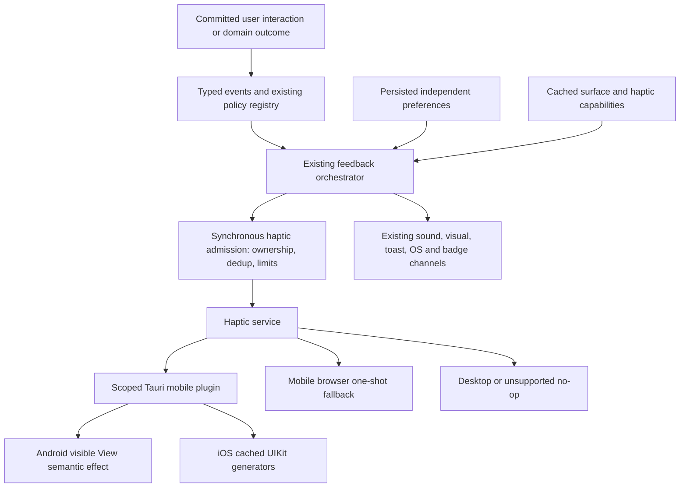

## Context

See [proposal.md](proposal.md) for the product motivation and [interaction-inventory.md](interaction-inventory.md) for the complete call-site and journey audit. Audit reference: local HEAD `7976f42b`, 2026-10-09; remote HEAD was not fetched. This change contains planning artifacts only.

### Current state

- `src/utils/soundService.ts` combines audio and browser vibration. `supportsHaptics()` requires `navigator.vibrate` before considering Tauri; it cannot discover native iOS hardware. Its arbitrary patterns have no native semantic mapping or global rate limit.
- `useHapticFeedback` gates both sound and vibration on `notifications.feedbackSoundsEnabled`; its visual-feedback setting is already separate. `navigationFeedback.ts` repeats the sound gate. The orchestrator requires a sound role and `roleIsEnabled` to admit haptics; completion haptics therefore depend on notification sound settings too.
- `useLongPress`, `useSwipeGestures`, `useTrainFeedback` and `RSSScrollMode` perform direct browser vibration. Rating joystick, Toast, the hook and Back use the legacy helper. These bypass a persisted haptic policy, and several deliver before an async action succeeds.
- `MobileSettingsPanel` is exported from `MobileNavigation.tsx`; its vibration toggle is component-local state. It has no persisted value to recover. `NotificationSettings.tsx` changes its sound description based on browser haptic detection and claims sounds also control haptics.
- `settingsStore.ts` persists under `plethora-settings`, version 14, with rebrand dual-read storage, a migration pipeline and category-wise default merging. Add a category through those paths rather than another localStorage key. `reviewStore` already exposes a stable backend session ID and distinguishes successful review commits from pending Arena choices/errors.
- ReviewSession handlers and ReviewFeedback mounting both trigger completion/streak; ReviewComplete also emits completion plus delayed milestone. FlashcardScrollItem/Zen emit clicks before submission. This requires owner migration, not merely changing the underlying pulse function.
- Existing `src/lib/feedback/{events,policy,capabilities,orchestrator}.ts` is functional despite stale scaffolding comments. It has typed events, channel policies, toast/OS downgrade logic, cooldowns, review suppression and test suites. Add haptic-specific policy here. Do not replace its sound roles or reminders.
- Back coordination already exists in `applicationBack.ts`, `contextualBack.ts`, `overlayStack.ts`, `nativeBackBridge.ts`, `MobileLayoutWrapper.tsx`, `navigationFeedback.ts` and `plethora-navigation`. Completion/defer/suppress semantics are in use, including dirty settings. `MainActivity.kt` installs the controller only when `NATIVE_BACK_ENABLED`; Gradle's `plethoraNativeBackEnabled` defaults false. The predecessor change retains unchecked native/device tasks. Do not claim it is fully deployed or enable it in this change.

### Verified dependency and native conventions

| Boundary | Version / source verified locally | Constraint |
| --- | --- | --- |
| Rust Tauri | `=2.11.5` in Cargo.toml and Cargo.lock | New plugin uses same exact runtime version, concrete `Wry` like existing first-party plugins. |
| Build/plugin helpers | `tauri-build` and `tauri-plugin` resolved 2.6.3 | Reuse `tauri_plugin::Builder`, generated command permissions and mobile paths. |
| Frontend | `@tauri-apps/api` resolved 2.11.1; CLI 2.10.0; React 19.2.4; TS 5.8.3 in package-lock | Manifest ranges are not exact pins; no framework upgrade required. |
| Android app | compile/target SDK 36, minimum SDK 26; AGP 8.11.0, Kotlin 2.2.21; NDK 27.2.12479018 | Navigation library minSdk 24 does not lower the application's minimum. Guard API 30/34 constants. |
| iOS app | 14.0 in tauri.ios.conf.json, project.yml and generated Xcode project | UIKit generators and hardware capability probe fit current target; do not raise it. |
| Plugin precedent | `plethora-folder-import` includes Android, SwiftPM iOS and Rust registration; navigation provides scoped Android capability | Match Swift package/product/target/static library names to Rust crate name; names cannot acquire a `tauri-plugin-` prefix accidentally. |

`openspec list --specs` shows no base haptics/feedback-orchestration/native-Back capability. Existing flashcard-review-session, toast-extract-feedback and context-menus specifications retain their behavioral contracts. Active `unify-notifications-and-sound` describes feedback-orchestration; active `fix-native-mobile-back-navigation` describes Back. This new change adds four orthogonal tactile capabilities; do not archive or replay either predecessor just to get haptics. During implementation update stale comments, relevant tests and conflicting predecessor guidance narrowly, preserving sound and navigation contracts.

## Goals / Non-Goals

**Goals:** One native mobile driver, one semantic policy registry, one feedback owner for each operation, immediate admission without notification queries, independent settings and a complete migration. Native Android and iOS implementations and device verification are mandatory.

**Non-Goals:** Custom haptic compositions, arbitrary amplitudes, controller/Pencil/desktop trackpad feedback, a new Back recognizer, background vibration notifications, replacement audio assets or a scheduler/UI rewrite. Do not add tactile feedback to every click. Existing visuals and accessible action outcomes remain independently useful.

## Decisions

### 1. First-party Tauri mobile plugin

Create `src-tauri/plugins/plethora-haptics/` with Rust crate/package/links name `plethora-haptics`, plugin namespace `plethora-haptics`, Android namespace `com.plethora.haptics` and class `HapticsPlugin`. Register Android through `register_android_plugin`, iOS through `tauri::ios_plugin_binding!(init_plugin_plethora_haptics)` / `register_ios_plugin`; Swift exports the matching `@_cdecl` initializer. Follow folder-import's concrete `Wry` state and mobile cfg pattern.

Build script declares three commands: `get_capabilities`, `configure`, `perform`, and registers `.android_path("android").ios_path("ios")`. Rust wrappers validate serialized enums and bounded IDs; mobile execution uses Tauri's plugin invocation, without blocking the app event loop. Use async Rust commands and a blocking worker for `run_mobile_plugin` where it waits on the native response. Native response must resolve once; unsupported/system-disabled is an ordinary skipped result, not a failure.

Register the plugin with the app on mobile. Desktop builds must compile its shared model/tests but never instantiate Kotlin/Swift; desktop command branches return unsupported if invoked defensively. Add `src-tauri/capabilities/mobile-haptics.json` restricted to `platforms: ["android", "iOS"]`, trusted `main` window/webview and `plethora-haptics:default`. Use Tauri's canonical platform identifiers (the existing Android-only capability uses `android`); validate generated schema on both targets. Default permission permits only those three commands. Do not grant remote URLs, all windows or a wildcard command permission. Generated Gradle/Xcode plugin links come from path dependency/build script, not hand registration in Activity/AppDelegate.

A first-party plugin gives controllable semantics, settings and tests, reuses the repository's integration model and needs no paid service. A third-party generic vibrator would leave settings/policy ownership unresolved; app-only Rust commands with ad hoc JNI/Swift embedding would duplicate Tauri plugin glue. Browser vibration alone cannot satisfy native iOS support. Tauri's [mobile plugin development guide](https://v2.tauri.app/develop/plugins/develop-mobile/) describes the Kotlin/Swift bridge model; repository folder-import is the concrete integration exemplar.

### 2. Stable bridge and frontend contracts

Conceptual TypeScript contracts to implement (not production code in this proposal):

```ts
type HapticIntensity = "subtle" | "standard" | "strong";
type HapticEffect = "selection" | "activation" | "threshold" | "commit"
  | "success" | "warning" | "error" | "completion" | "celebration";
type HapticSupport = "available" | "unavailable" | "unknown";
interface HapticCapabilities {
  protocolVersion: 1;
  driver: "android-native" | "ios-native" | "browser" | "none";
  driverSessionId: string; // opaque per native plugin lifetime
  configurationRevision: number; // current native revision, including after webview reload
  hardware: HapticSupport;
  systemPreference: "enabled" | "disabled" | "unknown";
  intensityControl: "effect-style" | "fixed" | "none";
}
interface HapticConfiguration {
  driverSessionId: string;
  revision: number;
  enabled: boolean;
  intensity: HapticIntensity;
}
interface NativeHapticRequest {
  driverSessionId: string;
  revision: number;
  interactionId: string;
  effect: HapticEffect;
  ttlMs: number; // remaining time budget, bounded 1..150
}
type NativeHapticResult = {
  status: "submitted" | "skipped";
  reason?: "unsupported" | "disabled" | "background" | "stale"
    | "rate-limited" | "system-suppressed";
};
```

Rust wire names are camelCase; Kotlin/Swift command names are `getCapabilities`, `configure`, `perform`, reached by Rust snake_case plugin commands. IDs are nonempty, at most 128 characters; unknown enum/protocol values are rejected without output. Native `submitted` means a platform API was invoked, not a claim that the user physically felt it. Configuration returns the applied revision; stale/foreign sessions are skipped.

Create `src/lib/feedback/haptics/{types,service,nativeDriver,browserDriver,noopDriver}.ts`. The service owns driver lifecycle and best-effort nonthrowing delivery; it does not own a second event registry. Components use `emitInteractionFeedback(eventId, payload, context): void` exported from the existing orchestrator for interaction events, or existing `void emitFeedback(...)` for domain events. Internal `haptics.selection(context)`, `.activation`, `.threshold`, `.commit`, `.success`, `.warning`, `.error`, `.completion`, `.celebration` can be convenience methods, but must resolve a registered event/context through the same admission function, never call a driver directly. Prefer the typed event entry point at call sites.

Context carries facts/identity, not channel preferences: `{ interactionId, operationId?, gestureId?, step?, sessionId?, origin: "user" | "system" }`. Event payloads include actual outcomes and entity IDs only where needed; do not send document text, titles, selected words or other user content to the haptic plugin. Identity must survive helper/component/store handoff. A step distinguishes a gesture detent from its later commit. Once the registry has selected an effect, the driver receives only the admitted effect and compact identity.

### 3. Android semantic mapping

`HapticsPlugin` retains a weak reference to the loaded main WebView (or its attached visible view), performs output on `activity.runOnUiThread`, and checks attached/visible/resumed state before execution. Probe motor presence using `Vibrator.hasVibrator()` (query only); on API 31+ use the default vibrator through VibratorManager where appropriate. The probe does not mean raw vibration delivery is permitted. Return unknown on a failed probe and skip output until a successful capability refresh.

Use `View.performHapticFeedback(constant)` with default flags. Never set ignore-view/system flags or force-enable the view's own haptic setting. Query the system touch-feedback setting for displayed status where readable; the platform call remains the authority, including changes since the last capability refresh. A false return is skipped, with no stronger fallback. This approach requires no added `VIBRATE` permission, as documented in [Android's View haptic guidance](https://developer.android.com/develop/ui/views/haptics/haptic-feedback).

Application-owned mapping (style preference, not arbitrary motor strength):

| Effect | SDK 34–36 | SDK 30–33 | SDK 26–29 | Intensity behavior |
| --- | --- | --- | --- | --- |
| selection | Subtle: `SEGMENT_FREQUENT_TICK`; Standard/Strong: `SEGMENT_TICK` | `CLOCK_TICK` | `CLOCK_TICK` | Frequent soft ticks may deliberately be silent on some hardware. |
| activation | `CONTEXT_CLICK` | `CONTEXT_CLICK` | `CONTEXT_CLICK` | Stable contextual style; all intensities may match. |
| threshold | `GESTURE_START` | `GESTURE_START` | `CONTEXT_CLICK` | One gesture-armed signal. |
| commit | `CONFIRM` | `CONFIRM` | `VIRTUAL_KEY` | Stable confirmation; no error-like stronger substitution. |
| success / completion / celebration | `CONFIRM` | `CONFIRM` | `VIRTUAL_KEY` | One semantic success. Celebration does not imply a custom waveform. |
| warning / error | `REJECT` | `REJECT` | `LONG_PRESS` | Brief legacy attention fallback; warnings/errors can converge by platform. |

These choices are the product mapping; API availability and meanings are from [HapticFeedbackConstants](https://developer.android.com/reference/android/view/HapticFeedbackConstants). Compile against 36, guard at runtime for 30/34. Standard/Strong can intentionally produce the same Android effect. Do not retry a refused frequent tick using a louder pulse. No direct `Vibrator.vibrate`, waveform/envelope generation, amplitude promise or permission addition is justified for these interactions. Device tuning can change an effect-style mapping with recorded evidence, but cannot replace meanings or weaken settings/suppression.

### 4. iOS native generators

`HapticsPlugin.swift` imports UIKit, Tauri, SwiftRs and CoreHaptics. All generator construction/use/configuration runs on the main queue (UIKit's generator API is main-actor isolated). Cache selection, notification and impact generators for the plugin lifetime; release on inactive/background teardown and rebuild lazily on resume. Use iOS-14-compatible constructors/methods; newer view/location constructors require availability guards and are unnecessary for this feature. See [UIFeedbackGenerator](https://developer.apple.com/documentation/uikit/uifeedbackgenerator) for generator roles and [UISelectionFeedbackGenerator](https://developer.apple.com/documentation/uikit/uiselectionfeedbackgenerator) for discrete selection semantics.

| Effect | UIKit delivery | Intensity behavior |
| --- | --- | --- |
| selection | `UISelectionFeedbackGenerator.selectionChanged()` | Fixed platform effect; no fake intensity adjustment. |
| activation / threshold | `UIImpactFeedbackGenerator.impactOccurred()` | Subtle `.soft`, Standard `.light`, Strong `.medium`. |
| commit | impact occurred | Subtle `.light`, Standard `.medium`, Strong `.heavy`. |
| success / completion / celebration | `UINotificationFeedbackGenerator.notificationOccurred(.success)` | Fixed semantic pattern, one call. |
| warning / error | notification occurred with `.warning` / `.error` | Fixed semantic pattern, one call. |

Success, warning and failure patterns retain their native meanings under [UINotificationFeedbackGenerator](https://developer.apple.com/documentation/uikit/uinotificationfeedbackgenerator). Intensity selection alters supported impact styles; it never scales fixed selection/notification patterns. Arbitrary `impactOccurred(intensity:)` amplitudes are not needed. Prepare a selected generator once on enabled configuration/resume and after actual repeated gesture feedback where appropriate; do not continually warm idle hardware or add per-frame bridge calls. A cold first effect is valid and must be measured.

Use `CHHapticEngine.capabilitiesForHardware().supportsHaptics` only as a hardware probe ([Apple capability documentation](https://developer.apple.com/documentation/corehaptics/chhapticengine/capabilitiesforhardware())). Do not create/start a Core Haptics engine. It adds no needed semantic behavior and would create engine/audio lifecycle and custom-pattern complexity. Unsupported phones/tablets/simulators return unavailable and no-op; do not infer support from model names or use alert vibration as fallback.

iOS has no public UIKit getter for all global haptic preferences that this design can use. Report system preference as `unknown`, use system-managed generators without override, and test relevant OS settings on devices. Do not claim sound/ringer mode is equivalent to haptics-off, use private settings access, or promise that `submitted` proves delivery. Apple's [haptic design guidance](https://developer.apple.com/design/human-interface-guidelines/playing-haptics) supports short, consistent effects and user control. Device tests distinguish global vibration accessibility controls from System Haptics behavior; if a specific setting does not suppress a generator on a supported OS, document that limitation honestly while preserving the app's independent off control.

### 5. Independent settings and capability lifecycle

Add top-level `Settings.haptics: { enabled: boolean; intensity: HapticIntensity }`, default `{ enabled: true, intensity: "subtle" }`. A desktop-stored preference is inert because desktop driver is `none`; do not base native capability on viewport width or UA. Use `isNativeMobile()` / authoritative OS plugin classification before selecting a native driver, including wide tablets/fullscreen.

Increment persistence schema from 14 to 15 (or next unused version if implementation HEAD has advanced). Migration: preserve valid existing `haptics` values; for pre-haptic snapshots with an explicit boolean `notifications.feedbackSoundsEnabled`, seed enabled to that boolean to preserve the user's previous effective opt-out/opt-in; missing/invalid legacy value uses true. Intensity defaults subtle and invalid values normalize to subtle. The initializer must normalize both wrapped `{settings: ...}` and historical root formats already supported by migration. Category merge handles partial same-version snapshots too. Do not alter either sound setting or visualFeedbackEnabled. There is no persisted MobileSettingsPanel vibration preference to migrate; do not invent a key or guess its last local value. After migration, sound changes cannot change haptics. Explain this one-time opt-out preservation in user documentation.

`NotificationSettings.tsx` contains separate accessible Haptic Feedback and Haptic Intensity controls on mobile surfaces, with capability/system status and short text: “Intensity changes effect styles where supported; some effects stay the same.” Its sound descriptions refer only to sound. `MobileSettingsPanel` uses the same store category and a shared `HapticSettingsControls.tsx`; replace only its vibration state, not unrelated stub settings. Both controls work immediately, survive remount/restart, use localized labels/options and display unsupported or system-controlled status without a permission prompt. Preferences remain editable on unsupported mobile hardware for future devices. On desktop, omit the haptic section and keep audio settings unchanged. Changing the intensity can provide one explicit preview action; merely rendering controls must never vibrate. Disabling never produces a preview pulse.

Initialize once after settings hydration/native readiness, cache a capability result (including negative results) and subscribe once to haptic preferences. Native starts disabled at revision 0. Acquire opaque driver session and current configuration revision via `get_capabilities`, choose a strictly greater revision, send `configure` for hydrated preferences, then admit effects only after its applied-revision response. Reading the current revision also makes a webview reload safe while the native plugin remains alive. Changes immediately disable frontend admission, bump revision and asynchronously configure native; drop interactions while configuration is pending rather than queue them. Native ignores lower revisions and checks current revision/enabled state immediately before output; new session IDs prevent old requests affecting a reloaded plugin. On inactive/pause, native clears pending work and frontend drops interaction state. On resume refresh capabilities/configuration once; no missed-event replay. Detach listeners/store subscriptions on teardown; StrictMode/remount cannot multiply them.

Browser/PWA: only mobile surfaces with an available Vibration API get the browser driver; preserve existing Firefox-Android-PWA exclusion and no-op iOS behavior unless runtime capability genuinely changes. API presence is best-effort, not proven hardware. Use short one-shots after policy: selection 8 ms, activation/threshold 12 ms, commit/success 18 ms, warning/error 22 ms, completion/celebration 25 ms; Subtle ×0.7, Standard ×1, Strong ×1.2, round/clamp 5–30 ms. Never play long/looped patterns or retry `false`/exceptions. Browser system preference is unknown; let browser restrictions apply. Desktop browser/desktop Tauri remain no-op even if an API or mobile-looking UA exists. Native plugin failure never falls through to browser vibration; that would hide a native integration failure and could bypass system suppression.

### 6. Extend existing orchestration, including a fast path

Extend the existing typed event registry and its contract test. Add policy metadata `kind: "interaction" | "domain"` and `haptic: null | { effect, cooldownMs, priority }`; separate haptic cooldown/dedup from the existing channel-wide domain cooldown. `haptic` no longer derives from SoundRole. Keep existing sound/OS/toast/badge fields and helpers intact, except deliberate per-channel separation and removal of stale “navigation/card flips always silent” comments. New micro events are haptic-only by default (existing inline visuals, no new toasts, OS alerts or sounds). Events/owners/effects are fully enumerated in the inventory.

`emitInteractionFeedback` lives in `orchestrator.ts`, resolves registered interaction events synchronously using hydrated current settings and cached haptic capability, and never calls notification permission/periodic sync/quiet-hour services. Existing `emitFeedback` admits its haptic channel synchronously through that same resolver before any async notification queries, then resolves the other channels using current existing policy. It does not deliver a second haptic after awaiting. When hidden, suppress app-driver haptics even if a toast/OS notification is allowed; OS notification vibrations remain governed by OS notification settings, outside this foreground UI preference. Quiet hours govern attention channels as currently defined, not foreground user gestures. Haptics can exist for events with null sound role; soundHandledExternally never suppresses haptics.

Admission and safeguards are shared by all entry points:

1. Reject silent/unregistered events, system-driven ordinary transitions, unhydrated/pending configuration, disabled preference, unsupported capability and background state before loading/invoking a driver.
2. Resolve one semantic effect by outcome and priority: selection 0; activation/threshold 10; commit/success 20; warning 30; error 40; completion 50; celebration 60. Failed/pending actions cannot nominate successful outcomes. If one commit finishes a session, choose completion instead of the card commit; if it also crosses a significant streak, choose celebration instead. Keep required completion/celebration audio and visuals independently. Do this at the domain owner with a combined outcome, not by delaying every event to guess the future.
3. Deduplicate by operation/interaction identity plus phase/step, independent of component/event alias. Reserve the key synchronously before starting async work. Use a bounded 256-entry, 30-second-expiring cache and a session/milestone ledger tied to the active session/day. Session result effects never replay on remount; distinct same-entity actions use new operation IDs. Native duplicates use the same compact ID with a bounded 256-entry cache.
4. Global spacing: selection/activation/threshold/commit minimum 60 ms; success/warning/error/completion/celebration minimum 120 ms since the previous effect. At most 8 admitted effects in any rolling second; at most 4 outcome effects in that second. Critical outcomes may replace lower-priority *not-yet-dispatched* feedback from the same operation, but never bypass global limits or disabled/system settings. Excess effects are dropped, not delayed. Mirror ceilings in the native plugin as defensive admission.
5. Per-event cooldowns: grading commit 100 ms; joystick selection 80 ms; tab/Back/tool/option change 100 ms; context activation 250 ms; mutation success/failure 250 ms; generic toast error/warning 1000 ms per incident; session/milestone 1000 ms plus stable identity ledger. Refresh threshold is once per gesture, not merely a time cooldown. Event cooldown suppression affects haptics only unless the existing domain policy separately suppresses other channels.
6. Joystick only emits on a new non-null grade that is actually selected, never null→null or valid→dead-zone. Assign gesture ID and monotonic transition ordinal; returning to a previous valid grade is a new meaningful transition, subject to 80 ms spacing. If a boundary arrives during the cooldown, suppress it and update the selected grade; do not emit later without a new transition. Cancellation resets without commit.
7. PullToRefresh arms at the first crossing, latches until touch end/cancel/unmount/disable; retreat/re-cross in the same gesture stays silent. Add touchcancel cleanup to that existing recognizer. Keep success silent; failure can produce a separate error outcome. This does not add another recognizer or change scroll thresholds.
8. No FIFO of effects, timers for patterns or replay. Limit native performs in flight to one; while outstanding drop new effects. frontend/native queues enforce a 150 ms age/deadline; native stamps receipt with its own monotonic clock and checks elapsed queue time (never compare JS performance.now to native uptime). JS computes remaining TTL at bridge dispatch. Clear admission reservations appropriately on synchronous skipped delivery, but keep identity dedup for the attempted operation so retries cannot spam it.

Latency acceptance: haptic JS admission p95 <1 ms under the seeded test workload; no awaited haptic work in action handlers; on an unloaded real phone aim for physical effect onset p95 within 50 ms of the committed/threshold UI marker. Any onset beyond 100 ms must be investigated; driver drops work older than 150 ms. These are measurement targets, not platform guarantees; record device/load/method and tune hot-path implementation before shipping. Do not invent timing precision from a Jest mock or a manually felt vibration.



```mermaid
sequenceDiagram
  participant UI as Existing action owner
  participant P as Existing orchestrator
  participant H as Haptic service
  participant N as Native plugin
  UI->>UI: Commit action and update UI
  UI->>P: Event with stable operation ID and outcome
  P->>P: Select one effect; check prefs/capability/limits
  P->>H: Fire-and-forget admitted effect
  H-->>UI: No awaited haptic dependency
  H->>N: perform(session, revision, identity, effect, TTL)
  N->>N: Check config, foreground, duplicate, expiry; main-thread API
  N-->>H: submitted or skipped (never required for action success)
```

### 7. Ownership, toast compatibility and Back

Prefer existing operation owners: review store for persisted review commits, queueActions for queue mutations, documentStore for imports, useToastExtract for highlight saves, useTrainFeedback for training, BookmarkManager for bookmarks. Alternate hosts not using those owners must create one ID before invoking their existing mutation and emit after its success. Do not move hardware output into low-level CRUD APIs where background callers would start vibrating.

`reviewStore` currently catches errors and can return without committing for Arena preview. Emit inside its successful state-commit branch, not unconditionally after awaiting `submitRating`. Keep grading arithmetic and scheduler calls unchanged. Use backend session ID plus a per-attempt/commit ID; separate new submissions after undo. Compute session/milestone coalescing there. ReviewSession, ReviewFeedback and ReviewComplete must cease independently requesting the same haptic. ReviewComplete can retain existing sound/toast/badge logic via domain emission with a per-channel ownership token; do not double-play sound when changing the haptic owner. Remove the delayed duplicate milestone haptic, retaining intended existing sound layering.

Toast helper options gain an explicit owned-feedback context/token (not inferred from toast text or toast IDs). Domain emission uses the store directly; the rendering container has no delivery effect. `useToast.success/warning/error` without an owner emits a registered compatibility event for eligible meaningful foreground feedback with per-incident cooldown; ordinary info/progress is silent. A domain-owned helper toast uses the token to mark its sound/haptic channels handled independently. Raw `addToast` remains visual-only. Keep existing undo/edit actions/live-region behavior. Confirm dialogs emit only through committed action owners; opening a destructive prompt is not an error.

`createNavigationCompletion` remains the Back adapter. Its `.complete()` emits `navigation.back-completed` with the existing transition ID; `.defer()` / `.suppress()` behavior and return signatures stay intact. Preserve `createNavigationFeedback` test injection via an admission callback, rather than implying a synchronous boolean proves native delivery. Root/timeout/blocked/cancel/IME/native picker system handling never emits app output. Native ACK is independent of haptic resolution. No controller/Activity changes, new edge recognizer, gesture exclusion or rollout toggle changes are required for haptics.

Primary tabs emit only after the requested destination becomes active, not on same-tab press or programmatic restoration. Context/selection-sheet presentation shares long-press identity. Back dismissal supersedes any generic sheet-close cue. Honor existing gestureTargets, text selection, page/Library/queue swipes and native Android edge ownership; haptic code never consumes pointer events or changes preventDefault/exclusion rectangles.

### 8. File-by-file implementation map

| Files (existing unless marked new) | Required changes |
| --- | --- |
| `src-tauri/plugins/plethora-haptics/Cargo.toml`, `build.rs`, `src/{lib,models}.rs` (new) | Three-command mobile plugin, cfg dispatch, validated wire models, nonblocking Rust wrappers and testable admission model. |
| Plugin `android/build.gradle.kts`, `consumer-rules.pro`, `android/src/main/java/com/plethora/haptics/{HapticsPlugin,HapticPolicy}.kt` (new) | SDK-compatible mapping, lifecycle/main-thread delivery, native config/dedup/limits; JUnit and instrumented coverage in corresponding test directories. |
| Plugin `ios/Package.swift`, `ios/Sources/{HapticsPlugin,HapticPolicy}.swift`, `ios/Tests/` (new) | Matching static target, Tauri/SwiftRs dependencies, UIKit cache, hardware probe, serialized lifecycle/configuration and Swift tests. |
| Plugin `permissions/default.toml` and generated command permissions (new) | Least-privilege capability contract; generate with existing build tooling. |
| `src-tauri/Cargo.toml`, `Cargo.lock`, `src-tauri/src/lib.rs`, `src-tauri/capabilities/mobile-haptics.json` (new capability) | Path dependency, mobile registration, lock update, scoped Android/iOS permission. No MainActivity/AppDelegate hand edits. |
| `src/lib/feedback/haptics/` (new), `src/lib/feedback/{events,policy,capabilities,orchestrator,index}.ts` | Driver/capability cache, typed interaction payloads, independent haptic admission, domain/interaction channels, exports and debug suppression counters. |
| `src/stores/settingsStore.ts`, `src/components/settings/NotificationSettings.tsx`, `HapticSettingsControls.tsx` (new), `src/components/mobile/MobileNavigation.tsx` | Versioned preferences/merge, shared connected mobile controls, committed tab change ownership and sound-only descriptions. |
| `src/lib/i18n/locales/{en,de,es,fr,ja,zh}.ts` | Haptic labels, status, intensity explanation; remove combined audio/haptic copy. |
| `src/utils/soundService.ts`, `src/hooks/useHapticFeedback.ts` | Extract hardware concerns, preserve audio exports/assets and visual preference; migrate compatibility consumers. |
| `src/hooks/{useLongPress,useSurfaceMenu,useSwipeGestures,useRatingJoystick,useTrainFeedback}.ts` | Gesture identity/accepted activation, no direct output; detent and training ownership as inventory. |
| `src/components/mobile/{SwipeableItem,PullToRefresh,MobileQueueView}.tsx`, `src/components/review/queueActions.ts` | Commit-based swipe, one refresh latch, selection/batch owners, error outcome. |
| `src/stores/reviewStore.ts`, `src/components/review/{ReviewSession,ReviewComplete,ReviewFeedback,ZenReviewMode,FlashcardScrollItem,QuickReviewWidget,ArenaChoiceRail,AlgorithmArenaDecision,MemoryHorizon,ReviewQueueView,SixGradeRatingControl}.tsx` | All mobile review inputs funnel through success owner; reveal/choice events; remove duplicate completion and pre-success output; preserve sounds/visuals/scheduler. |
| `src/hooks/{useToastExtract,useInlineExtraction}.ts`, `src/components/viewer/{DocumentViewer,SelectionPopup,SelectionActionsSheet,HighlightLayer}.tsx`, `src/components/viewer/selectionInteraction/{useSelectionInteraction.ts,DictionaryPeek.tsx,SelectionActionBar.tsx}`, extract create/edit/delete dialogs | One explicit activation/annotation-save owner across reading surfaces; handled toast tokens and meaningful tools. |
| `src/components/position/BookmarkManager.tsx`, `src/components/documents/DocumentsView.tsx`, `src/stores/documentStore.ts` | Bookmark/document/bulk/import save boundaries; user operation IDs and batch summaries. |
| `src/components/media/{RSSScrollMode,RSSReader,PodcastManager,MediaLibrary,ClipExtractor}.tsx` | Shared training/favorite/Library mutation owner, significant clip/download/task results; playback/continuous updates silent. |
| `src/lib/navigationFeedback.ts`, Back tests and mobile settings navigation tests | Independent completed-transition haptic; preserve completion adapter and existing Back rollout. |
| `src/components/common/{Toast,ConfirmDialog}.tsx`, `src/components/extracts/DeleteConfirmDialog.tsx` | Central helper policy, owner tokens, silent renderer and confirmation opening. |
| `src/lib/feedback/__tests__/`, new haptic tests, relevant existing component/store/hook tests | Matrix, concurrent ownership, fallback, migration, threshold/cancel, native request count, lifecycle/failure coverage. |
| `src/lib/feedback/haptics/policy.bench.ts` (new), `scripts/perf-baselines.json`, `scripts/bundle-budgets.json` only if justified | Seeded synchronous policy benchmark; intentional performance/budget changes explained, no masking failed gates. |
| `docs/android-build-notes.md`, `docs/ios-build-notes.md` if present or a new native-haptics guide, this change's verification report | Plugin regeneration, system limitations, independent settings and measured/device evidence. |

Search/player files with deliberately silent rows need changes only where a significant committed action requires centralized feedback. A listed path is an integration location, not a mandate to rewrite the file. Use existing test locations and update exact paths after a HEAD refresh.

### 9. Accessibility and validation

Haptics never replace visible confirmation, inline errors or screen-reader announcements. Retain `visualFeedbackEnabled` and reduced-motion behavior independently; disabling animation or audio does not automatically disable haptics. Keyboard/VoiceOver/TalkBack activation of the same action gets the same bounded tactile outcome; automatic focus movement does not. Settings have explicit labels, option names, disabled/unsupported status and keyboard access. Critical events still honor haptics-off and system suppression.

Validate the normative scenarios in four specs and every inventory row using [validation.md](validation.md). Automated policy tests use fake clocks/drivers, deterministic IDs and seeded data. Race tests prove synchronous dedup prevents concurrent async domain emission from doubling output. Native mapping/config/lifecycle tests complement physical motor verification. Desktop/web tests must run with existing sound/visual preferences to catch migration regressions. Real Android/iPhone tests are release gates; simulator/unit tests cannot mark them complete.

## Risks / Trade-offs

- [OEM effects and fixed intensity] → Semantic styles can converge across levels; retain honest settings copy and verify at least two Android actuator/device classes. A system-refused soft tick remains silent.
- [iOS settings visibility and unsupported hardware] → Use public capability probe and system generators; system status unknown where unobservable, unsupported no-op, real iPhone/iPad and relevant OS-setting evidence. No private API or raw alert-vibration workaround.
- [Bridge latency drops rapid events] → Warm module/capability cache, synchronous resolver, compact payload, native prepare and limits; drop old/in-flight excess rather than emit late. Tune with recorded onset measurements.
- [Asynchronous disabling] → Frontend stops admission immediately, native configuration revision suppresses stale queued work once applied. A physically started effect cannot be undone; document this finite in-flight boundary rather than promise instant motor cancellation.
- [Incomplete predecessor rollout] → Keep Back's rollout independent; verify haptics on both existing fallback and opt-in native completion path. No second navigation implementation.
- [Cross-channel regressions] → Separate haptic admission from domain cooldown/sound role; owner tokens mark each channel explicitly, and sound/visual/off combinations get regression tests.
- [Generated mobile builds] → First-party plugin build paths generate links; verify release/R8/Swift linkage and regeneration in a disposable copy without overwriting the user's project.
- [Default migration surprises] → Preserve explicit legacy combined preference once, never continue linking controls; local mobile toggle cannot be recovered. New installs default to enabled/Subtle.

## Migration Plan

1. Refresh audit/version and existing native build instructions; implement/test plugin, scoped permissions and driver behind disabled native configuration until hydration.
2. Add versioned settings, shared controls, independent policy and startup/resume configuration; retain existing audio/visual behavior.
3. Migrate all direct/legacy delivery and assign operation owners. Introduce success-boundary emission and combined session outcome atomically with removing duplicate callers. Finish every inventory row; no mandatory feature is deferred.
4. Run automated, local performance/build, native linkage and required device matrix. Record build revision and unresolved hardware gaps; no production enablement is claimed until both Android/iOS acceptance evidence exists.
5. Deliver one coherent implementation with all mandatory features. If rollback is necessary, revert haptic plugin/integration together while leaving schema-compatible haptic preferences stored; preserve version/merge readers and existing sound/native Back behavior. Unsupported driver remains no-op. Do not restore the combined sound/haptic control as the rollback mechanism.

There are no unresolved architectural decisions. Device feel/latency tuning is bounded by the declared semantic mappings, limits, specification and required measurement tasks.
